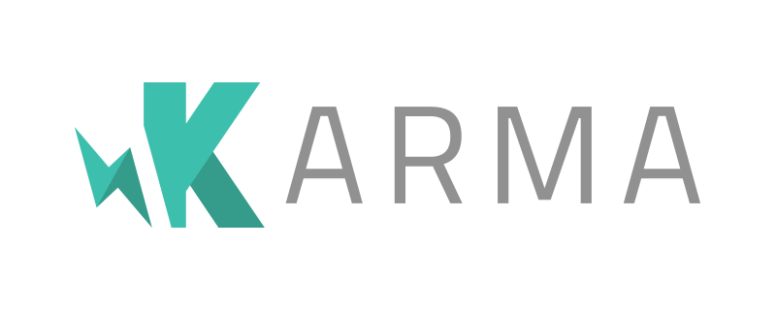
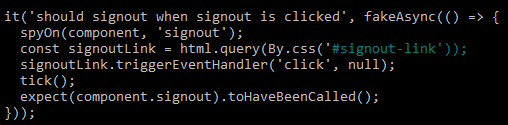
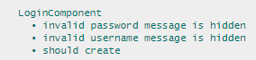
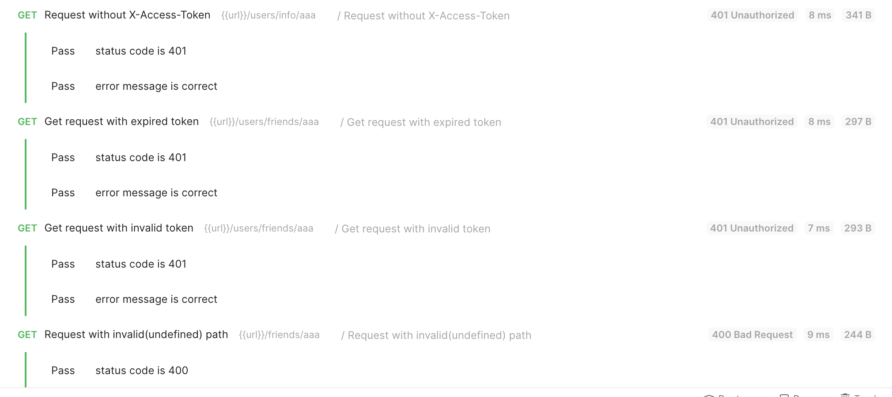

<div align="center">


</div>

___

# Evaluation

In this section, we evaluate our app. We start by evaluating the design of the app, looking at the strengths, weaknesses and lessons learned. We then move on to unit testing, with a focus on how our selected harness helped us throughout the project build. Finally, after unit testing, we go on to look at user acceptance testing and we reflect on our working practices and successes.

## Table of contents

* [**Evaluation of design**](#evaluation-of-design)
  * [Methods used](#methods-used)
    * [Paper prototyping](#paper-prototyping)
    * [Wireframing](#wireframing)
    * [Questionnaires](#questionnaires)
    * [User stories](#user-stories)
    * [Heuristics](#heuristics)
    * [Other possible methods](#other-possible-methods)
    * [Timeline of evaluation of design](#timeline-of-evaluation-of-design)
* [**Unit testing**](#unit-testing)
  * [Front-End](#frontend)
  * [Back-End (AUTOMATE API TESTING)](#back-end-automate-api-testing)
  * [Testing implementation](#testing-implementation)
* [**User acceptance testing**](#user-acceptance-testing)
  * [Beta testing](#beta-testing)


## Evaluation of design


When it came to the design of the project we knew it was important to have a number of methods to perform an evaluation of the design. What's more, it was important to do this regularly so as to ensure the design developed and evolved consistently over time.

### Methods used

We turn to the methods used and evaluate the effectiveness of each of these. It is worth noting that given the time constraints of this unit, we were unable to use as many evaluation techniques as we would have liked. Heat map testing, surveys, interviews, and observations would have all been invaluable for gathering useful data about our users to inform our design decisions. We discuss this in the below subsection [Other possible methods](#other-possible-methods). But first, let's consider the first method we used to evaluate our product design, namely, paper prototyping.


### Paper prototyping

The first way in which we evaluated our design was through paper prototyping. At this stage, we used the shared powerpoint in Teams to brainstorm and design each web page separately with consideration of the content and functionality of each page. There are a few advantages with this approach. Firstly, it’s fun. Paper prototyping ought to be fast and leads to rapid iteration, taking a matter of minutes to create a few different versions of a design. Secondly, it's low cost.  The toolset required includes a pen or pencil and a piece of paper. Thirdly, and related to the first two advantages, paper prototypes are a low commitment. It's inexpensive both in terms of cost and time, so there's very little commitment. And if the designs don't look good, you can start again without losing any sleep. Fourthly, it is a really good way to obtain early feedback from users. These users can be involved in the design process before the more substantive stages of design and coding begin. Fifthly, they look crude and basic, which results in people feeling more comfortable about criticising the prototypes than they would if the prototype was more developed and refined. Finally, we found that it was a really good team building exercise. Since paper prototyping doesn’t require any special skills, everyone can get involved in a collaborative effort.

**Limitations**

Now, for the limitations. The first limitation is that paper prototypes require a great deal of imagination from test participants—they have to imagine how the future state of a product will look like just by looking at the paper. The second limitation is that they are best done in person, or with a few people via video conferencing (as was the case for our team). However, we managed to successfully create a paper prototype virtually on Microsoft Teams, and while it wasn't an optimal approach it certainly didn't prevent us from a fruitful ideation exercise. The third limitation is that the paper prototype will need to converted into a digital format, so one could argue that skipping the paper prototype is an unnecessary step.

With these limitations in mind, we decided to create a short video demo of the paper prototype. This addressed the issue of participants being unable to imagine how the product would look, and it meant that the prototype could be sent to people across the country and globe. This meant that we were able to obtain feedback from a wide range of users, all dispersed geographically. We integrated all the web pages together and focused on adding navigation between the pages. We filmed a short video demo to make sure the navigation flowed properly. This video is below:

<br/><br/>
<p align="center">
  
  <br/>
  <b >Paper Prototype Demo</b>
  <br/><br/>
</p>

This approach to evaluating the design was very effective since it had all the benefits of a paper prototype without the drawbacks mentioned above. It was largely inexpensive to produce and it was simple to share among users. One way in which this process could have been improved is by conducting user testing through facilitator and human-computer roles. Testing sessions which utilise this technique to test a paper prototype, rely on three main roles: a facilitator (presenter), a 'human computer', and participants. The facilitator is responsible for instructing test participants. The 'human computer' remains silent during the session and is responsible for changing the screens of the platform in response to the test participant interactions with the product.

### Wireframing

At this stage, we converted the paper prototype of our website to a wireframe to simulate all the features (including the structure of menu, button control, requests and responses) we have planned with the use of [Figma](https://www.figma.com/) (a digital design and prototyping tool). See our initial wireframe version [here](https://www.figma.com/proto/0CgBZ0XKPHl8fCcgvPSsWr/NotSoBoredGames-Copy?node-id=6%3A137&scaling=scale-down&page-id=6%3A121).

Wireframing proved to be a very effective way of evaluating our design. The UI wireframe above provides a low-fidelity skeleton of the UI. This serves to show the main features, layout, content, and functionality of the UI, without getting bogged down in the visual design of the app. It is essential in UI design as it determines what the user will eventually interact with when they eventually use the software, and it helps those working on the front-end of the product to better understand how they should design and build the main features and functions of the UI. We distributed the digital UI prototype to the potential users and created a test to gather user feedback with a focus on the feasibility of the website, the functionality and ease of use. We distributed our digital UI prototype to the potential users with an online questionnaire to gather feedback and update our wireframes.

The main advantages of wireframing are as follows. Firstly, it is a simple way to encourage end-users and clients in the design process. Involving these stakeholders involved in the early stages of product development is really helpful because once you have their feedback those who are in charge of the UX and UI are left with a good idea of the desired features, functionality, and style of the product. This also means that the stakeholders are involved in the design process very early on, and they made aware of the direction the product is going in. Furthermore, this has the added benefit of providing a rationale for the key decisions concerning the design on the product. Another benefit of wireframing is that it provides a clear skeleton of the application. This can serve as a blueprint for the design which can be used to inform good UX decisions from a information-hierarchical point of view.  Finally, creating a a quick wireframe can  save a team a lot of time and money. This is because it can be used to establish a better understanding of the project requirements, which will then be fine-tuned to basic user requirements. This, in turn, reduces the likelihood of costly redesigns down the line.

**Limitations**

Despite the benefits of wireframing, there exist several limitations with this evaluative method. The first issue concerns how stakeholders can get overly concerned with the minutiae of the product design. This can hold up the design process, particularly if the stakeholders become preoccupied the specific details of the design. In terms of timeliness, this design step is *another* step to be taken, so one might argue that it's worth skipping and moving on to a more substantive design stage.   

If your wireframes are too designed, it means that too much time is being taken up by them. Remember, they’re only there to help you map out the very basic flow of your website, so it shouldn’t be a huge step in the process. Editing a drawing over and over takes a chunk of unnecessary time. It’s much easier to make vital changes if you’re using programs like Balsamiq instead. When a wireframe has been signed off, there’s little room for creative change for your designer. They must adhere to the functionality of your agreed website skeleton, which pens-in the option for other creative possibilities that may require a different flow.


### Questionnaires

Questionnaires proved to be a very useful method for answering specific questions about our paper prototype and wireframe, and it opened up the possibility for quantitative data. It had the advantage of being able to reach many people with low resource requirements and the disadvantage that the design and phrasing of the questions needed to be well constructed to provide strong, reliable data and avoid the negative effects of human judgment bias.

See our full test report [here](https://my.helio.app/report/01F1WDKPM82XVYYJVE0HS5Q93T).


**Limitations**

One further limitation of our use of questionnaires concerns the size of the questionnaires we conducted. In the questionnaire, participants were all known to our team. Two problems arise. First, the size and diversity of the research sample are arguably an inadequate representation of the target population. As such, findings derived from the study are not generalisable to the wider population. Whilst we acknowledge this shortcoming, there was scope for us to make greater efforts to reach our target audience, unknown to ourselves, and recruit them. Second, given that the participants were known to various members of our team, issues regarding participation bias arise, wherein participants behave as they expect the experimenter desires, which undermines the study's internal validity . To overcome these shortcomings, we could have recruited people not known to our team. This would have generated a more diverse pool of participants not known to our team and mitigated against the lack of generalisability and participation bias.

### User stories

Proto-personas based on assumptions about the relevant stakeholders, and are designed to simulate the approach taken in a real-life agile project, during which there is a continuous dialogue between the software development team and their clients, owing to the client-led approach at the heart of the agile framework.

This approach relies on an [autoethnography](https://www.researchgate.net/publication/260778406_Autoethnography_as_a_research_method_Advantages_limitations_and_criticisms) approach. An autoethnography is a form of qualitative research based on self-reflection and the process of writing to explore and understand personal experiences and connect this autobiographical story to wider societal issues. For our purposes, this relates to self-reflection on the position of our stakeholders via proto-personas. This was an excellent method for adding stakeholders into our agile development, and meant that despite being able to meet older adults in person show them our product, we were able to reflect on what their responses might be. This, together with the questionnaire data we gathered meant we could adjust our UI and UX design to best serve our end-users. This was extremely useful for evaluating our design, since it was a quick, easy way to obtain feedback about our product.

**Limitations**

One of the main limitations of autoethnography is its emphasis on the self. Specifically, it is regarded as too individualised. On this point, [Sparkes (2000)](https://journals.humankinetics.com/view/journals/ssj/17/1/article-p21.xml) claims, "The emergence of autoethnography and narratives of self…has not been trouble-free, and their status as proper research remains problematic".  Autoethnographies have been criticised for being self-indulgent and individualised (Atkinson, 1997; Coffey, 1999). Another criticism concerns the accuracy of the research method. In particular, is it a reliable guide to the truth in the sense that the personal narratives or autoethnographies represent the ground truth. On this point, Walford (2004) states, ["If people wish to write fiction, they have every right to do so, but not every right to call it research"](https://www.researchgate.net/publication/240709622_Finding_the_limits_Autoethnography_and_being_an_Oxford_University_Proctor). Ellis and Bochner (2000), claim autoethnography as a narrative that, "…is always a story about the past and not the past itself"[[**1**]](#references). [Walford (2004)]((https://www.researchgate.net/publication/240709622_Finding_the_limits_Autoethnography_and_being_an_Oxford_University_Proctor)) also claims that "…the aim of research is surely to reduce the distortion as much as possible". Walford's concerns are focused on how much of the accounts presented as autoethnographies represent real conversations or events as they happened, and how much they are just inventions of the authors. Denzin and Lincoln (2000) state, "Objective reality can never be captured. We can know a thing only through its representations"[[**2**]](#references). Overall, then, the benefit of autoethnography is the ideas that emerge from the interaction between reflection on the users with consideration of the cultural and social context in which the user exists. It is through this process of reflection that useful insights are generated, which have primae facie value as a research tool.


### Heuristics

Heuristics are a useful method because they can help in predicting user behaviour and when compared to primary data can uncover important research questions and hypotheses. They're also a fast, economical way of obtaining data from users, and an easy method to apply. Overall, they serve as a quick way to identify and resolve usability and design problems with individual elements of the system and how those problems may impact the UX.

**Limitations**

One of the downsides of heuristics commonly make assumptions about products and people. Heuristics may not be suited to novel technologies. This is because there is a risk of new technology outpacing heuristics. However, despite these considerations, heuristics are a great tool for making the design do's and don'ts intuitive. For our purposes, heuristics were perfect because we didn't have access to many users given the covid crisis. And this was even more of an issue for our team since our target end-users are the most at-risk group with regard to the Covid-19 virus.

Before moving on to other possible methods for design evaluation, let's consider some of the strengths and weaknesses of this approach.

<table>
<tr>
  <th>The Pros</th>
  <th>The Cons</th>
</tr>
<tr>
  <td>- Focuses directly on specific issues, flag them and find optimal solutions <br /> - Identifies faults with individual elements and determine their impact on the overall UX  <br /> - You can obtain feedback without ethical issues and costs. </td>
  <td>- Insights are subjective; absence of proof and vulnerable to bias <br /> - Finding experienced evaluators may be difficult and costly  <br />- Can identify issues that aren't usability problems. </td>
</tr>
</table>

### Other possible methods

By this point it is probably clear that most of the data we obtained was qualitative. Qualitative methods generate data that are represented by observations or reports of people's opinions and behaviours. This method is best suited when the goal is to understand and represent the opinions and perspectives of the target users. Given this, qualitative methods seemed the natural choice when trying to evaluated our design. Analysing this type of data may include interviews, observation notes, open-ended survey responses, and user-diaries. There are several ways in which such data may be analysed with differing levels of rigour. On reflection, we would have liked to employ a mixed methods approach to generate both quantitative and qualitative data, using one to inform the other (that is, 'triangulation'). However, this lay outside the scope of our project due to the time constraints impose on use and the nature of the product we were developing. Despite this, there exist different methods we could have used that would have served to help evaluate our product design.

**Fitts’ law**
Fitts' law (1954) is an empirical research model of human behaviour that can be used to predict or estimate evaluative outcomes. The law states that the amount of time required for a person to move a computer mouse cursor to a target area and select that target area. Therefore, ["...the time to acquire a target is a function of the distance to and size of the target"](https://www.slideserve.com/ilandere/human-factors-and-fitts-law-ken-goldberg-ieor-and-eecs-uc-berkeley). Fitts’ law is widely applied in UX and UI design. For example, it has had influenced the current convention of designing interactive buttons to large. This is especially important for smartphones where smaller buttons are more difficult and prone to error than larger ones. This law is particularly important in the overall design of the visual interface which interacts with a mouse. Indeed, it can be used to assess the appropriate sizes of interactive elements according to the context of use and identify usability issues.

**Thematic analysis** is the final method we will consider here. This is a popular and flexible means of applying structure and a prescriber process for your analysis. In short, this approach involves gathering together your data from all available sources, creating category labels ("codes") that describe emerging and or expected patterns trend, apportion evidence for instance quotes from users, add research observations beneath each category, and then reorganise the codes into a hierarchy tree and group related items so as to generate themes. This would have been a great evaluation method, and were we to continue with this product we would definitely look to use it. As previously stated, we would have liked to use a number of these other methods but were unable to do so as we had to prioritise building and testing the key features of our application. Having covered some of these different methods, we can now put the methods we did use into a timeline.


### Timeline of evaluation of design

You can find the timeline for our evaluation of design below:


## Unit testing

<a name="frontend"></a>
### Front-End
Functional testing is paramount to the successful launching of our MEAN stack SPA. Thankfully the MEAN stack includes some prerequisite software which helps implement easy front-end functional testing on the differing components.
The software includes Karma which is a test-runner for JavaScript which runs on Node.js. Karma is great for testing code in browsers as well as different devices. The software allows us to clearly see which tests are failing within the specific components. This helps speed up the debugging process.



For Karma to work well we need to implement a test framework for our project. The are a wide variety of frameworks to choose from with some of the most popular being Mocha and Jasmine. Both of these frameworks allow us to write tests on our individual components. Mocha is a popular choice and actually also has an inbuilt driver which can also run tests in the browser just like Karma. Karma is however the better option to run these tests on thanks to its flexibility in its browser testing. Also, Mocha is lacking in assertion testing and requires a plug-in called Chai to be able to write such tests. Jasmine on the other hand already has these assertion tests built in. Weighing this all up we decided to choose Jasmine for our implementation.


Now that the framework was chosen, we could specifically test our JavaScript code using the Jasmine syntax which will capture any problematic component issues. See below for how these software’s were utilised on our project.
To begin the front-end testing, we had to produce a test plan as below:


This test plan outlines the specifics of our front-end testing. As you can see our focus was purely on the navigation of our users as well as logging out effectively. We also fixed all the default angular tests such that all components are created. In order to implement this, we had to edit the components spec files which our tests focused upon. As below:

### Implementation

#### Test A.


#### Test B.


#### Test C.


#### Test D
We wanted to extend our testing to fix the default Angular tests so that we could see if there were any hidden issues in our components. For the most part this was simple and just required the adding of the RouterTestingModule and HttpClientModule. However, it did unearth a few unexpected issues. These resided within the card and Jitsi components.

The first issue with the card component was that the card class was not produced prior to checking the component existed. This caused an undefined issue given that the elements within the class were not assigned. This was a straightforward fix and just required an import of the card class and initializing an instance of this as below:


The second issue was with Jitsi. This issue still remains and can be observed as a failure after running ‘ng test’. Due to how the Jitsi library/API is written, this test failure is unavoidable. However, this does not impact the functionality or the user experience of the application, as discovered via rigorous during development and testing. The Jitsi library is written in such a way that even if imported locally and compiled with the project, the JitsiMeetAPI library has to be embedded and called via a <script> tag, meaning that it is not called until the application is loaded. This therefore meant that we had to use the 'declare' keyword to notify the TypeScript compiler that the variable exists and has a specific type, so that when the script is loaded, the object can be created and it's methods can be called.

To avoid this test failure, we could have used a library that enabled us to do everything within a folder local to the project, however with Jitsi providing us with the functionality required to deliver real-time video chat, and the user experience being unaffected, we decided to stick with Jitsi and make note of the failing test.


### Test Results
Through running ‘ng test’ we could easily see any issues within our front-end code which could be problematic for our users. The Karma software allows us to clearly see which components failed the specific tests and hints towards fixes for these.


#### Test A.


#### Test B & C.


#### Test D


Our functional testing showed that the navigation, login and logout of users is smooth and gives us confidence that the implementation was correct. Whilst the issue with Jitsi was unresolvable if we had further time then this could be something we would look to fix.

<a name="back-end-automate-api-testing"></a>
### Back-End (AUTOMATED API TESTING)

The backend API was tested vigorously using software known as [Postman](https://www.postman.com/), which is is a scalable API testing tool that allows us to run automated and thorough tests to our RESTful API.

Based on our [API design](../server), there are mainly 4 methods involved in our [API Testing](https://www.guru99.com/api-testing.html):

- GET- The GET method is used to extract information from the given server using a given URI. While using GET request, it should only extract data and should have no other effect on the data.

- POST- A POST request is used to create a new entity. It can also be used to send data to the server, for example, customer information, file upload, etc. using HTML forms.

- PUT- Create a new entity or update an existing one.

- DELETE- Removes all current representations of the target resource given by a URI.

To fully test these methods, we focused on two aspects:

- Test functionality

  Make sure your API does exactly what it’s supposed to do.

- Test exceptions

  Make sure your API handles unexpected input and behavior.


#### **Testing Implementation**

**Prerequiste**

[Postman](https://www.postman.com/): Testing tool to drive the API

[mongodb atlas](https://www.mongodb.com/cloud/atlas): cloud mongodb for checking data persistence

**Set up**

ensure you have a connected mongodb cloud database which you can check the data collection online

ensure you have a working api interface which is exposed on localhost port 3000

**Tear down**

remove all the changes to the database

**Tests:**

1. validate the API's error handling and the returned status code
2. validate the data and the status code returned by a request (GET)
3. validate the message and the status code returned by a request  (UPDATE, PUT, DELETE)
4. make sure that data is transferred/updated to the database correctly

API testing collection:

**Methods:**

To carry out testst, we used the `pm.response` object in Postman. You defined tests using the `pm.test` function, providing a name and function that returns a boolean (`true` or `false`) value indicating whether the test passed or failed. Then, we used [ChaiJS BDD](https://www.chaijs.com/api/bdd/) syntax and `pm.expect` in the assertions to test the response detail. Here are some selected parts of the testing codes:  

1. Test the status code

```javascript
//case: Any successful get request
//test: the status code should be 200
pm.test("status code is 200", function () {
    pm.response.to.have.status(200);
});

//case: Get request without valid token being provided
//test: the status code should be 401 (unauthorized access)
pm.test("status code is 401", function () {
    pm.response.to.have.status(401);
});
```

2. Test the response body : JSON value check

```javascript
//case: user sign up
//test: the returned data should contain the username as "Test"
pm.test("the user is apiTestor", function () {
    var jsonData = pm.response.json();
    pm.expect(jsonData.user).to.eql("Test");
});

//case: user log in with wrong password
//test: the returned error message should be "invalid password"
pm.test("error message is correct", function () {
    var jsonData = pm.response.json();
    pm.expect(jsonData.error).to.eql("invalid password");
});
```

3. Test the response body: Contains a property

```javascript
//case: user log in
//test: the returned data should contain a token
pm.test("has token", function () {
    var jsonData = pm.response.json();
    pm.expect(jsonData).to.have.property("token");
});

//case: retrieve a user's recent game activities
//test: the returned data should contain a date of each game instance
pm.test("has the date of a game instance", function () {
    var jsonData = pm.response.json();
    pm.expect(jsonData.gamesPlayed[0]).to.have.property("date");
});
```

4. Test the response body: Contains a string

```javascript
//case: get the user's friendlist
//test: the returned friendlist should contain username "bbb"
pm.test("has friend bbb", function () {
    pm.expect(pm.response.text()).to.include("bbb");
});
```

Please see our [published api document](https://documenter.getpostman.com/view/15388829/TzRLkVzq) for test scripts of each request

**Test Results:**
1. API tests



2. Database status


## User acceptance testing

We now turn to the user acceptance testing (UAT). According to one definition, user acceptance testing ["consists of a process of verifying that a solution works for the user"](https://en.wikipedia.org/wiki/Acceptance_testing). The most important consideration here is that UAT centres around whether the users are able to use the application, and whether the application behaves in expected ways.

There exist three main software testing phases:

   1. Alpha testing
   2. Beta testing
   3. Gamma testing

Alpha testing involves internal tests conducted by a team of testers and developers. It is designed to identify bugs through imitating the behaviour of a real user. This type of testing has the advantages of fixing issues immediately by a team of internal developers which is relatively easy to organise and can help catch any bugs that need to be addressed. The main disadvantage of this approach is that it focuses on usability tests and doesn't address the security or reliability of the product. Beta testing is the next phase of testing which involves both imitating end-users to stress-test the system and also having the product tested by end-users in real time to find bugs and ascertain the quality of the product. The advantages of this testing is that it helps identify whether the application can successfully run with live use and data. The disadvantages of this approach is that it can be difficult to find the end-users and testers. Finally, there is Gamma testing. This phase of testing, unlike the previous two phases, doesn't result in any changes to the front or back-end of the system (unless, that is, there is some nontrivial bug which needs to be fixed). It is the final stage of testing to determine the performance and functionality of the application. The advantages of this type of testing is that it ensures that the product is ready for release, and gives a certain level of assurance that the safety, functionality and responsiveness of the product is ready for release.

In both Beta and Gamma testing, the focus is on the UX and to verify software compatibility with different software and different network connections. The participants should, in theory, be unknown to the software development team and have no prior knowledge or experience of the product. This is to control for various experimental biases, which is important because doing so increases the likelihood of gathering honest, objective insights. Because of the time constraints imposed on us, were were unable to find a group of participants unknown to our team. We also decided to skip the Alpha and Gamma testing phases and move straight to the Beta testing by conducting a field test prior to product launch.


### Beta testing

As mentioned above, the main purpose of this testing was to verify software compatibility with different software, different network connections, and to get the users’ feedback on software usability and functionality. This testing involved a focus group of 6 older family members via video conferencing. To preserve the anonymity of the participants, we will not refer to their names or disclose any personal data regarding them. We also obtained consent from the participants, and assured them that the feedback they provided would be anonymous. We did not have time to apply for ethical approval from the University of Bristol's Research Ethics committee. Our focus group is, therefore, an ad hoc attempt at Beta testing.

The structure of the testing was as follows. We gave the group a list of points to consider when using and interacting with our product. These points were:

  - the functionality of the application
  - the usability
  - the visual appearance of application

Here, 'functionality' refers to whether product behaves the way it should irrespective of its design, and 'usability' refers to whether the product behaves the way it should, but also takes into account the navigation, content, clarity, styling, and layout of the product.

We took observation notes and asked the participants to write down notes about the product. These notes were then used to develop an affinity chart. Overall the feedback was very helpful for identifying any design issues or functionality problems. During the session, we used screen sharing to demonstrate how to use the application.

The feedback is summarise in the affinity diagram below:


The main suggestions for improving the product were:

   * Additional instructions required, particularly for the games.
   * More games would be preferable.
   * Rewards and prizes would enhance the gaming experience.

This helped inform our design choices and tested the functionality of the platform. Whilst this was a really useful test to perform before pre-release, we would have benefited from more time and resources to conduct this type of field testing on a group of participants unknown to us for both Beta and Gamma testing.

**Limitations of Beta testing**

The main limitations with this type of user acceptance testing was the role of biases in affecting our users' feedback. In particular, given that the participants were known to various members of our team, issues regarding participation bias arise, wherein participants behave as they expect the experimenter desires, which undermines the study's internal validity [[**4**]](#references)). A further issue concerns the size and diversity of the research sample are arguably an inadequate representation of the target population. As such, findings derived from the study are not generalisable to the wider population or indeed our end-users [[**5**]](#references)). Whilst we acknowledge this shortcoming, there was scope for us to make greater efforts to reach our target audience, unknown to ourselves, and recruit them. To overcome these shortcomings, recruitment fliers and ‘community gatekeepers' to assist in recruitment could have generated a larger, more diverse pool of participants not known to our team and mitigated against the lack of generalisability and participation bias [[**6**]](#references)). This would be especially important if we were to conduct hypothesis testing in the future, because hypothesis testing - that is, determining the role of independent and dependent variables - requires reliable data.

A further limitation of our user testing concerns the range of methods used. With our testing we could have used heat map testing, surveys, questionnaires and other testing methods to improve our acceptance testing. Overall though, we feel our Beta testing helped us gain useful feedback prior to product release.

### References

[1] Ellis, C. (2004). The Ethnographic I. Walnut Creek, CA: AltaMira.

[2] Denzin, N (2000). "Aesthetics and Qualitative Inquiry". Qualitative Inquiry. 6 (2): 256–260. doi:10.1177/107780040000600208. S2CID 145207054.

[3] Reiter, B. (2017). Theory and Methodology of Exploratory Social Science Research. Government and International Affairs Faculty Publications. 132.

[4] Keeble, C., Barber, S., Law, GR., Baxter, PD. (2013). Participation bias assessment in three high impact journals. Sage Open, 3(4), 1-5.

[5] Keller, J., Ainsworth BE. (2016). Recruiting participants into pilot trials: techniques for researchers with shoestring budgets. Californian journal of health promotion, 14(2):81–89.

[6] Alan, R. (1999). The Importance of Hypothesis Testing. Behaviour Change, 16(2).

___

## Navigate

- [Go To Next Section: Conclusion](../Portfolio/Conclusion.md)
- [Go To Previous Section: Sprints & Project Management](../Portfolio/Sprints_Project_Management.md)
- [Go Back To Readme](../README.md)
