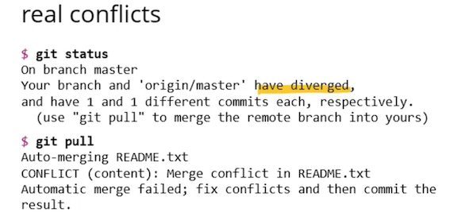

<div align="center">


</div>

___

# 4. Sprints & Project Management

In this section, we discuss project sprints and management. We start by going over the team organisation, roles, and contributions. We then move on to discuss the way we approached communication and documentation of sprints. Finally, we discuss the team use of git and the impact Covid-19 had on our working practices.

## Table of contents

* [**Group working methods**](#group-working-methods)
   * [Software Development Lifecycle](#software-development-lifecycle)
      * [The waterfall method](#the-waterfall-method)
      * [The Agile methods](#the-agile-method)
      * [Agile : Our chosen methodology](#agile--our-chosen-methodology)
* [**Team Organisation**](#team-organisation)
* [**Team roles and contributions**](#team-roles-and-contributions)
* [**Communication**](#communication)
* [**Documentation of sprints**](#documentation-of-sprints)
   * [Sprint 1 : Ideation and Setup (01.03.21-08.03.21)](#sprint-1--ideation-and-setup-010321-080321)
   * [Sprint 2 : Start building front-end and design back-end (08.03.21-15.03.21)](#sprint-2--start-building-front-end-and-design-back-end-080321-150321)
   * [Sprint 3 : Obtain user feedback and continue building front-end (15.03.21-22.03.21)](#sprint-3--obtain-user-feedback-and-continue-building-front-end-150321-220321)
   * [Sprints paused : Complete backlog items and other work commitments (22.03.21-29.03.21)](#sprints-paused--complete-backlog-items-and-other-work-commitments-220321-290321)
   * [Sprint 4 : Add multiplayer functionality, video chat and build backend (29.03.21-12.04.21)](#sprint-4--add-multiplayer-functionality-video-chat-and-build-backend-290321-120421)
   * [Sprint 5 : Adding new features (12.04.21-19.04.21)](#sprint-5--adding-new-features-120421-190421)
   * [Sprint 6 : Front-end and back-end integration (19.04.21-26.04.21)](#sprint-6--front-end-and-back-end-integration-190421-260421)
   * [Sprint 7 : Pages made responsive and API finalised (26.04.21-03.05.21)](#sprint-7--pages-made-responsive-and-api-finalised-260421-030521)
   * [Sprint 8 : Finish report and complete unit testing (03.05.21-07.05.21)](#sprint-8--finish-report-and-complete-unit-testing-030521-070521)
* [**Team use of Git**](#team-use-of-git)


## Group working methods

With regard to the group working methods, we knew it was very important to maintain regular contact with one another throughout the duration of the unit. Given that we were working remotely, communication was obviously essential. For a discussion on our chosen form of communication, see [Communication](#communication).

We also realised the importance of delegation. So, to ensure that the team was organised with a clear, delegated structure in mind we assigned team roles. For a discussion of this, see [Team Organisation](#team-organisation) and [Team roles and contributions](#team-roles-and-contributions).

## Software development lifecycle

In order to produce working software, it is important to follow a recognised methodology. This is because a methodology helps guide collaborative decision making from project initiation to production use by end-users. There exist two main methodologies for this purpose: the waterfall model and the Agile method. These methods cover the planning, design, coding, testing and production involved in software development. Both have their merits and drawbacks. We'll now take a look at these approaches.

### The waterfall method

First, we'll look the waterfall method. The lifecycle of this approach is depicted below:

<div align="center">


</div>

The main focus of this approach is structure. Milestones are set, breaking the project into manageable chunks. These chunks represent phases which are connected in a linear sequence, where each phase in the sequence requires certain deliverables to initiate the next phase. This creates a waterfall-style process of development.

### The Pros:
- Consists of clear defined stages
- Phases completed in a linear process, one after the other
- Straightforward to manage
- The lifecycle is well documented and easy to follow

### The Cons:
- Inflexible to changing requirements
- Excludes the client
- Working software not produced until late in the lifecycle
- Hard to identify and measure progress within each stage
- Testing occurs near the end of the lifecycle

<a name="the-agile-method"></a>
### The Agile methods

Now, let's take a look at the Agile methodology. The lifecycle of this approach is depicted below:

<div align="center">


</div>

The main feature of this model is that software development is broken down into incremental cycles.

This method is flexible throughout the build. It is flexible with respect to the stakeholders, which means that the product is more tailored to their needs. There are no rigid rules with the Agile system development lifecycle. it can be changed and altered as required by your project or organisation. Given the flexibility of this method, one of the most important aspects of the method is communication, since the wants and desires of the stakeholders may change during the initial planning and the iterations of the lifecycle.

There are several different frameworks used to implement the Agile method: Feature Driven Development (FDD), Dynamic Software Development (DSDM) and Crystal Methodologies.

### The Pros:
- Client-focused approach
- Flexibility allows changes to occur at any stage
- Working software delivered quickly
- Allows for improvement of features designed earlier in the lifecycle

### The Cons
- Easy to lose focus if the client is unclear on their requirements
- Insufficient attention given to design and necessary documentation
- Lacks predictability
- Greater time and commitment
- No finite end to the project


### Agile : Our chosen methodology

In light of the strengths and weaknesses of both methodologies, we decided to use the Agile approach for our project development. The reason for this was fourfold. First, we really liked the client-focused approach of Agile. This was, we felt, appropriate for our purposes since our application was designed with important usability requirements. Without regular feedback from our end-users then, we wouldn't necessarily be able to meet those usability requirements, and produce a product which they would actually be able to use. Second, we liked the idea of building software quickly. This was really relevant for our project since we only had 12 weeks to build our product whilst balancing the competing demands of two other units. Third, and related to the two previous reasons, being able to improve the features iteratively early in the lifecycle seemed more sensible as it would allow us to change the design of the product whenever required. Had we chosen to follow the waterfall approach, this type of flexibility would have been out of the question. Fourth, and finally, we felt that the inflexibility of the waterfall method, particular with regards to changing requirements, would really hamper the development and prevent us from producing a usable product. As such, it seemed like an untenable method for our particular purposes.

<div align="center">


</div>

The format of our software development was as follows. Our build was broken down into sprints. Each sprint centres around a particular set of features, tests to test the robustness those features, and making sure that our users' expectations and demands are met through the creation of those added features. Following standard practice - as well as advice from the teaching staff - we broke the sprints into weekly cycles. During each cycle we created a backlog of tasks/features and user stories. We used the user stories in each sprint from previous sprints to help inform the project development. We then reviewed our progress during our weekly meetings. During these reviews we conducted integration testing and assurance testing. Following this, we then aimed to  merge all changes to the main branch of Github. This did not always happen, however, as some new features took longer than others to build and implement.

Our sprints got under way in the beginning of March. These continued until early May. Each sprint centred around feature implementations required for that week, as well as including any tasks in the backlog from previous sprints. The goals for the week were decided and we kept to those goals until the end of the week. We reviewed our work at the end of each sprint. This meant that our approach towards the development of the product was consistent with the agile methodology. Given the fact that we had very little time to build the product, we felt that it was important to deploy a working application as soon as we possibly could.

With respect to the meetings and sprints and how they worked, we met every Monday at 11am. And then on Wednesdays and Fridays. In every successive meeting we discussed the work we had done, and when items were assigned tasks as "complete". We compiled a list of Backlog and items that were complete. Overall, though, at the heart of this process was the users. During every sprint we had the users in mind, ensuring that we addressed their goals and demands.

### Scrums

We used the Scrum framework to apply Agile working practice. This entailed one team member acted as the 'Scrum master'. The scrum master was responsible for dictating the timelines on Github and making sure that everything was on track. This meant that we had a clear agreement amongst our team as to when our main deliverables for the week were expected by, as well as offering guidance on which user stories were being used for that week.

### Jira

We used Jira to implement these actions, and created Gantt charts to visualise the progress of tasks. Jira helped structure the timetable so it was clear what was being done by who and where in the lifecycle it sat. We started by laying out the tasks needed in the ‘To Do’ section. This was a rough draft and some tasks were broken up into multiples later. We then allocated team members in our meetings and moved to the ‘In Progress’ section once they had started. Finally, we could tick of and move tasks to the ‘Done’ pane once team members had progressed. Whilst Jira was helpful, some issues were noted in the way that tasks could still remain even when the sprint had ended. This was minor however and the task would just be added to future sprints. Overall, the platform was very helpful in getting the team organised and added motivation from seeing the tasks being ticked off one by one.

<div align="center">


</div>

### Product backlog

Within Jira there is a Backlog. This is a product backlog which contains list of the main deliverables we intended to implement during each sprint. These deliverables, or items, are prioritised to ensure that the most important features are completed before less important ones. These items were carried forward to subsequent sprints were we unable to complete them within the intended sprint. This served as an essential part of our product development, since it helped our decision making with regard to task assignment and prioritisation.

The presence of an item in the backlog guarantees that the item is being worked on. However, it does not ensure that the item will be completed before the end of the sprint, or at all. In some circumstances, backlog items will not be completed due to practical issues. In the following, we give a detailed account of each sprint, the actions which arose from it and how our two users "Bob" and "Simon" felt about the new features.


## Team Organisation

Each of our team members had a unique set of skills that they were able to bring to the project, with different strengths and perspectives. Given this, we decided to assign roles to team members according to where they thought their strengths lay in software engineering.

Every team member participated in discussions concerning system design and implementation to ensure that we were in agreement on the goal and scope of the project. This meant that everyone in the group was continually up-to-date on the changes and developments of the application, and there were no unsaid grievances about actions or decisions that were being taken. We were open, honest and respectful towards one another throughout the build period. As such, we maintained good group cohesion.


## Team roles and contributions

We assigned team member roles through an open conversation on Microsoft Teams. In what follows, we give a quick breakdown of the individual roles of each team member and the reasons for those role assignments.

Given Lizhao's strengths in coding, she naturally wanted to be involved in both the front and back-end of the build. Her clear, logical approach to all aspects of the build meant that she was an invaluable team member who could always be relied on. Harri took on the leadership role as the project manager whilst also working on the back-end, and contributing to design side of things. His strong leadership and steady hand meant that he was more than capable of steering us through every stage of the project, from ideation to implementation.

Like Lizhao, Chris's strengths lie in coding, but with a particular focus on the front-end. Given his skills in this department, he was happy to devote the majority of his time to the build and maintenance of the database and servers. He also offered great insights on every aspect of the build. As with the other team members, he was invaluable throughout. Max, who likes design, dedicated most of his time to the Front-end. He also took on the role of writing a lot of the documentation, and getting involved with the UI and UX design.

## Communication

In light of the COVID-19 pandemic and national lockdown, our team was unable to meet in person to discuss the system design and implementation. We were also unable to sit down and write code together. Given these constraints, it was essential that we kept in regular contact with one another. We did this via two communication platforms. The first platform we used was Microsoft Teams, which we felt was an excellent platform for hosting meetings. Throughout the project we took detailed team meeting notes which can be found [here](../Portfolio/Team_Meetings.md).

<div align="center">


</div>

The reasons why we chose this platform are as follows. First, by the beginning of TB2 we were all very familiar with the platform, since it had formed the basis of all our taught modules on the MSc. Second, we decided that given its messaging and video conferencing functionality we could easily move between typed messages and face-to-face discussions. The former were very useful throughout the day, as a way of sharing thoughts, ideas and developments concerning the project. The latter enabled us to simulate the type of face-to-face conversation that we would have had in the lab were in not for the national lockdown.

The second communication platform we used was Discord, the instant messaging group-chat platform designed for groups and communities. As with Microsoft Teams, we were familiar with Discord since we had been using it throughout TB1. This, too, was an excellent platform for instant messaging and quick-time communication.

<div align="center">


</div>

Because we were familiar with both of these applications, we were able to seamlessly communicate without any user error, and we were able to work collaboratively whilst living in different parts of the country which was essential given the Covid-19 crisis and national lockdown. In terms of the frequency of our meetings, we decided it would be reasonable to initially meet three times a week on Mondays, Wednesdays and Fridays, but with the flexibility to increase that frequency in the later stages of the module when we began weekly sprints.


## Documentation of sprints

The sprints are in chronological order, starting with the first sprint in early March all the way up to the final sprint in the beginning of May.


In what follows we will refer to the meeting notes, product backlog, list of key features to be implemented from previous sprints, and user feedback. Items in the backlog were tagged as 'Done' once they had been completed and implemented.

Each of these sprints are broken down into six parts:

 1. Main goals/aims of the sprint
 2. Key points from the meeting
 3. Key implementations from previous sprint
 4. Backlog items
 5. Feedback from users
 6. Evaluation

With this in mind, let's now turn to the weekly sprints.


## Sprint 1 : Ideation and Setup (01.03.21-08.03.21)
___


The aim of this sprint was to decide on our architecture and how we intended to progress with regard to communication. It also involved the ideation phase where we agreed upon the concept and design of our product. With regards to communication, we agreed on the main channels of communication, namely Microsoft Teams and Discord. We also decided to create stakeholder stories, including user stories, to help guide us during the development. We also made progress on our repository on Github. We tried to build on our understanding of the basic operations of GitHub, including merge conflicts, fast-forwards, and the importance of creating different branches and adhering to a GitHub protocol with respect to push and pull requests (for a discussion on our approach to GitHub, see [**Team use of Git**](#team-use-of-git). We added sections to our readme and made progress with our documentation. We agreed to build a start page for our application, and finalised our decision to build a online multiplayer game plaform for the elderly with video chat. In addition to this, from previous weeks we had decided to build four games and call the product 'NotSoBored Games'.

### Key points

   * We made the group decision to use the MEAN stack.
   * Create a group Discord server.
   * Design and build start page.
   * Set up GitHub repository and familiarised ourselves with the platform.
   * Agreed to setup a protocol with regard to GitHub.
   * Create a simple paper prototype of the UI design.
   * Create stakeholder stories.

**Attendees:** everyone in attendance.

### Backlog items

The following are a list of tasks and features that the team were tasked to deliver by the end of the sprint.

    ```
      → Backlog item: setup GitHub repository.
      → Backlog item: design and build start page.
      → Backlog item: create a GitHub protocol and familiarise ourselves with it.
      → Backlog item: create a simple UI design paper prototype.
      → Backlog item: create a group Discord server.
      → Backlog item: create stakeholder stories.

    ```

### Evaluation of Sprint

This was our first sprint. It followed several weeks of meetings regarding the design and ideation of our product. The main goal of this sprint was to establish main lines of communication, write up a GitHub protocol, create user stories, and build a start page. These tasks, we felt, were important because once main lines of communication were setup, a GitHub protocol was established, stakeholder stories were created, and a start page was built we could then work efficiently and effectively on individual aspects of the project. It was particularly important to make sure every team member had a good working understanding of how to use GitHub. On reflection, we should have made sure that the GitHub protocol was discussed in more depth so we all understood how to properly utilise the branch-based workflow. In particular, we would have benefited from one team member becoming an GitHub 'expert'. This expert could then have go on to teach other team members how to use the platform, thereby saving us time in the long-term by avoiding mistakes, errors, and a suboptimal approach to the GitHub workflow. Despite this, we still managed to effectively utilise the branch-based workflow which, for the most part, helped us avoid merge conflicts. Overall, we felt as though this was a very productive sprint which kickstarted the project and set us a trajectory of collaboration and development.


## Sprint 2 : Start building front-end and design back-end (08.03.21-15.03.21)
___

The aim of this sprint was to get something built and pushed onto GitHub. From previous weeks, we had decided to build four games. So, we assigned two games to team members. We discussed how our stakeholder stories would impact the design of our product, and we agreed that their feedback would be central to the development lifecycle, using their thoughts and ideas to change, add and modify features. From the previous sprint, we had created four stakeholders all of whom would, during every sprint, give feedback on newly implemented features. This was, we felt, a sensible approach since it meant that we'd be putting the needs of the stakeholders first, which in turn would ensure that the product was designed for them in such a way that it would be accessible, fun and appropriate. During the previous sprint, we had agreed to build something for the end-users as a number one priority. As such, by the beginning of this sprint we had something to show our end-users, namely a start page, which we could show them. This gave us the opportunity to identify problems and issues they might encounter when using the product and make corrections where necessary, thereby following the agile methodology.

### Key points

  * Games allocated to team members.
  * Browsed previously completed group projects together and took notes.
  * Discussed stakeholder stories and their feedback.
  * Work on documentation with a focus on background research and state-of-the-art survey.
  * Make data model (build a relational entity diagram of data model).
  * Navigation design

**Attendees:** everyone in attendance.

### Key implementations from previous sprint

   * GitHub protocol established.
   * Design and build start page.
   * User stories created.
   * Paper prototype and paper prototype video shown to users.
   * Update given on progress of games.
   * Browsed previously completed group projects together.

### Backlog items

 ```
   → Backlog item: start building games.
   → Backlog item: design backend.
   → Backlog item: make data model.
   → Backlog item: conduct background research and state-of-the-art survey.
   → Backlog item: analyze and improve ways for users to navigate through the app.

 ```

Given the client-led approach of the Agile method, we now turn to user feedback. Please note that these are fictional users whose feedback is based on real user feedback we acquired through our user testing. To see our user testing, please see: [Evaluation](../Portfolio/Evaluation.md).

### User feedback

<table>
<tr>
 <th>Users</th>
 <th>Feature</th>
 <th>Backlog item</th>
 <th>Feedback from Users</th>
</tr>
<tr>
 <td>
 <a href="UX_Design.md#identification-of-users-and-stakeholders">
 <br>Bob</a> <br /> As a user, I want to have a clear webpage to navigate.</td>
 <td>N/A</td>
 <td>Paper prototype video</td>
 <td>This is the type of website layout I was thinking of. The title is big and in a clear font, and so far there aren't too many features. I am happy with this paper prototype video, but I think I would need some instructions on how to use it. For instance, how do we login? </td>
</tr>
<tr>
 <td>
 <a href="UX_Design.md#identification-of-users-and-stakeholders">
 <br>Sally </a> <br /> As a user, I want to have face-to-face communication with others during the gameplay.</td>
 <td>N/A</td>
 <td>Paper prototype video</td>
 <td>I think a multiplayer game is a great idea. I also think that having a video feed would work really well, and help me see my friends and family members. The paper prototype video is clear and easy to follow, and I think having different levels of difficulty would be really good as I'd quite like to challenge myself, but I was hoping there would be a leaderboard so I know how well I'm doing.</td>
</tr>
<tr>
<td>
<a href="./UX_Design.md#identification-of-users-and-stakeholders">
<br>Jack </a> <br /> As a product manger, I believe we should use the Agile method.</td>
<td>N/A</td>
<td>Create stakeholder stories</td>
<td>I think it's a really good step to start communicate with your end-users from the very start of the project development, which you've done through creating user stories. The paper prototype video is also a very good idea, so well done with that. I am aware, however, that you've only built the start page. Whilst this is a step in the right direction, you still need to prioritise building other parts of the application. This is because the whole purpose of sprints is to produce something tangible which your end-users can properly engage with. This will ensure that you are always implementing the agile methodology, and that the product is on the right track with respect to the wants and needs of the end user. You want to build a minimum viable product (MVP) as soon as you can.</td>
</tr>
<tr>
 <td>
 <a href="../Portfolio/UX_Design.md#identification-of-users-and-stakeholders">
 <br>Simon </a> <br /> As a sponsor, I want a product with a UCD.</td>
 <td>N/A</td>
 <td>Paper prototype and research target population</td>
 <td>I like the look of this video paper prototype, and I think you are sensible to research the target group as a priority. In particular, you should bear in mind that the end-users may have visual, auditory and cognitive impairments. This should really guide your approach when designing the interface of the product.</td>
</tr>
</tr>
</table>

### Evaluation of Sprint

During this sprint, our focus was to get started on the front-end of the MEAN stack. This was because we wanted to have something to show our users as earlier as possible and obtain feedback which we could then be used to shape and influence the product design. Using the paper prototype video enabled us to use our autoethnographical approach to reflect on what our end-users would think of the prototype design. The feedback generated from this was really helpful, and served to sharpen our awareness of the wants and desires of our target end-users with respect to the functionality and appearance of our product. The backlog of items implemented from the previous sprint, such as creating stakeholder stories and a paper prototype, was therefore crucial for making sure that we were adopting the agile framework, putting the end-user first and adapting the product according to their feedback. We felt that this should always be at the forefront of our sprints, and recognised that our product manager and sponsor would help inform our design and development process. At this stage we would have benefited from focusing on producing a MVP as soon as reasonably possible, and setting a deadline for this. Whilst we were aware of the importance of producing an MVP, we didn't agree on a particular point in the development lifecycle to deploy one. On reflection, this would have been sensible because we could have then prioritised certain tasks and features earlier on so as to ensure we would be able to create an MVP. This could then be modified and improved on subject to user feedback and testing.


## Sprint 3 : Obtain user feedback and continue building front-end (15.03.21-22.03.21)
___

The aim of this sprint was to show older friends and family members our start page and obtain their feedback. By this point, the backlog items of building a start page and adding audio to the start page had been implemented from the previous sprint. This gave us a great opportunity to show members of our target user demographic the opening page of our application, and use their feedback in our stakeholder feedback. We prioritised the creation of a UI wireframe and obtained feedback through a questionnaire. This feedback included opinions on the style, structure, and layout of the stage page, all of which helped inform our understanding of the UI and UX. Having this knowledge then gave us an understanding of how to approach the remaining pages of our application. Further to this, we started this sprint with new insights we'd acquired from our state of the art survey, which gave us a better understanding of similar online gaming platforms and any gaps in the market. From these insights we discovered that, to the best of our knowledge, there were no online games for the elderly which had video chat and a very simple, intuitive layout. This encouraged us to pursue adding a video chat feature to our games, and cemented our belief that the UI should be as clear and straightforward as possible. We also agreed it was important to get working versions of the games in front of users as soon as we could, and to continue with documentation with a focus on sprints and project management. With regard to the back-end, we developed a data model to suit mongoDB style, and completed the API design, specifically routes and data.

### Key points

   * Obtain feedback from users regarding the start page.
   * Create UI wireframe and obtain user feedback.
   * Create and circulate questionnaire regarding UI wireframe.
   * Start building docker image.
   * Build basic versions of games and obtain user feedback.
   * Create user login and signup components.
   * Continue with documentation with a focus on Sprints and project management.
   * Convert Entity Relationship Diagram (ERD) to Unified Modelling Language (UML) diagram for data model
   * Design API.

**Attendees:** everyone in attendance.

### Key implementations from previous sprint

   * Build start page.
   * Memory game and connect four build underway.
   * Back-end design started.
   * Documentation underway with a focus on background research and UX design.


### Backlog items

```
  → Backlog item: continue researching video chat APIs.
  → Backlog item: obtain user feedback on UI wireframe through a questionnaire.
  → Backlog item: create login and signup components.
  → Backlog item: build basic version of games and obtain feedback.
  → Backlog item: relational diagram -> UML diagram.
  → Backlog item: design API.

```

### User feedback

<table>
<tr>
 <th>Users</th>
 <th>Feature</th>
 <th>Backlog item</th>
 <th>Feedback from Users</th>
</tr>
<tr>
 <td>
 <a href="./UX_Design.md#identification-of-users-and-stakeholders">
 <br>Bob</a> <br /> As a user, I want to see an engaging start page.</td>
 <td>Start page</td>
 <td>Start page</td>
 <td>I really like this start page. The bright colours are very engaging and the title is bold and in a clear font. I really like the background as well - it is eye-catching without being distracting. I really like the the music as well, but I think I would want the music to stop once I've logged in.</td>
</tr>
<tr>
 <td>
 <a href="../Portfolio/UX_Design.md#identification-of-users-and-stakeholders">
 <br>Sally </a> <br /> As a user, I want a start page that is easy to understand.</td>
 <td>Start page</td>
 <td>Start page</td>
 <td>The start page is very nice, but I think I would find the moving title a little bit nauseating if it were to continue during the login and gameplay.</td>
</tr>
<tr>
<td>
<a href="../Portfolio/UX_Design.md#identification-of-users-and-stakeholders">
<br>Jack </a> <br /> As a product manger, I want to see an engaging UI which is appropriate for the end-users.</td>
<td>N/A</td>
<td>Create and circulate questionnaire regarding UI wireframe/Relational diagram -> UML diagram.</td>
<td>This start page is really good - well done. I think the style and format is appropriate for your end-users, however I would stress that it is really important to gather user feedback as often as possible to ascertain what they think about the front-end design of the product. One thing you might want to consider is adding simple instructions for the login and entering the games. This is because it might be hard for them to navigate. It's important to remember that your end-users will more than likely have a low level of digital literacy, so you want to make your product very easy to use. For this reason, I would advise that your scrum leader makes sure that you are always revisiting the issue of usability and making sure the end-users are consulted on new features throughout the development lifecycle. With the relational diagram, will this work for MongoDB? I think you might need a model suitable for mongoDB. You will also need to give some consideration to the API design, in particular the routes and data.</td>
</tr>
<tr>
 <td>
 <a href="../Portfolio/UX_Design.md#identification-of-users-and-stakeholders">
 <br>Simon </a> <br /> As a sponsor, I want to see consistency in the UI and UX.</td>
 <td>Start page</td>
 <td>Start page</td>
 <td>I like the start page, and I think you should keep the style consistent throughout. There are still no games though. Can you try and show us something as soon as possible? It would be good to see what they look like, how challenging they are, and easy to navigate and understand.</td>
</tr>
</tr>
</table>


### Technical problems and solutions

<table>
<tr>
  <th>Part of MEAN stack</th>
  <th>Backlog item</th>
  <th>Stakeholder story</th>
  <th>Problem</th>
  <th>Solution</th>
</tr>
<tr>
  <td>Back-End</td>
  <td>Convert Entity Relationship Diagram (ERD) to Unified Modelling Language (UML) diagram for data model.</td>
  <td>Relational model to show the stakeholders.</td>
  <td>Relational model didn't work for MongoDB.</td>
  <td>Relational diagram. We chose a UML diagram, because the relational model didn't work for MongoDB. So, we developed the data model to suit mongoDB style - namely, something object oriented.</td>
</tr>
<tr>
  <td>Back-End</td>
  <td>Check api path.</td>
  <td>Developers are able to report the correct error message when there is a request on undefined path.</td>
  <td>Request on invalid url path.</td>
  <td>Catch all routes at the end of the file for each routes (`/api/games/xxx` or /api/users/xxx`) and return the status code `404.</td>
</tr>
</table>


### Evaluation of Sprint

We felt we were able to do a lot of work during this sprint. Having a start page to show the users and collect feedback was invaluable at this stage of the development. We were happy with a progress by this point in time. Using feedback from the questionnaire we could shape the opinions of our proto-personas. This proved really useful during this stage of the design and build of the start page, because we were able to identify that the moving title and the background audio might be a little distracting. With this in mind, we made sure that those effects were only present in the start page and did not extend into subsequent pages. The designs for the back-end were coming along nicely and it seemed that we would be able to integrate the front and back-end fairly easily. It was clear, however, that our workload in the other units of term was getting bigger, and as such our progress might slow down over the coming weeks. We also wanted to better understand how we would build the database and API. This would take time and was likely to be a backlog item which carried through to subsequent sprints.


## Sprints paused : complete backlog items and other work commitments (22.03.21-29.03.21)
___

By this stage, we felt it was appropriate to pause the sprints. The rationale for this decision was twofold. First, we had a large database assignment due in for the Java unit, which was challenging and took up most of our available time. Second, there were a number of unfinished backlog items from the previous sprints which needed to be attended to before proceeding to the next sprint. These reasons, we felt, were sufficient to warrant pausing the sprints before continuing onto the next one. The pause was a decision we took based on the situation we found ourselves in. It not only demonstrates the flexible nature of the agile methodology, but importantly, highlights that we understood it was important to complete uncompleted items. Another important aspect of this 'pause' was that it enabled us to get stuck into the documentation. From early on, we realised the importance of working on the documentation continuously. This not only helped keep a record of what we had done, but also, helped focus our attention on where we were heading and what we needed to do.


## Sprint 4 : Add multiplayer functionality, video chat and build backend (29.03.21-12.04.21)
___


This was the first sprint following the week pause to our sprints. By this point we had completed a lot of the backlog items, and had made a lot of progress both with the system implementation and the documentation. The aim of this sprint was to add multiplayer functionality, video chat and start building the back-end of our system. Having obtained feedback from users regarding the start page in the previous sprint, and created UI wireframe and obtain user feedback from a questionnaire regarding UI wireframe, we wanted to add multiplayer functionality and video chat. These features were essential for our product, since having identified [a gap in the market](../Portfolio/Background.md#a-gap-in-the-market) in the background section we knew that video chat with multiplayer mode were lacking in existing gaming platforms for older people. Another major aim for this sprint was to implement basic features such user login, signup, logout, get user information, get friend list, and add friend. And to test on all of those features.

### Key points

   * Implement multiplayer functionality for connect four.
   * Research and add video chat to the games.
   * Add a navbar to the main page.
   * Build backend (build MongoDB models with mongoose).
   * Build API using express framework and node.js.
   * Implement basic features such as login, signup, logout, etc.
   * Add a game instance - store game records persistently.
   * Authenticate user.

**Attendees:** everyone in attendance.

### Key implementations from previous sprint

   * Obtain feedback from users regarding the start page.
   * Create UI wireframe and obtain user feedback.
   * Create and circulated questionnaire regarding UI wireframe.
   * Dockerfile created.
   * Build basic versions of games and obtained user feedback.
   * Build user login and signup components.
   * Continue with documentation with a focus on Sprints and project management.


### Backlog items

```
  → Backlog item: implement multiplayer functionality for connect four.
  → Backlog item: add video chat to connect four.
  → Backlog item: build home page component and add navbar.
  → Backlog item: build backend (build MongoDB models with mongoose).
  → Backlog item: build API using express framework and node.js to implement login, signup, logout HTTP request methods and test.
  → Backlog item: build API for adding a game instance - store game records persistently and test.
  → Backlog item: create user.auth service for making API calls to authenticate a user.
  → Backlog item: implement user authentication connecting frontend and backend.

```

### User feedback

<table>
<tr>
 <th>Users</th>
 <th>Feature</th>
 <th>Backlog item</th>
 <th>Feedback from Users</th>
</tr>
<tr>
 <td>
 <a href="../Portfolio/UX_Design.md#identification-of-users-and-stakeholders">
 <br>Bob</a> <br /> As a user, I want to create an account.</td>
 <td>Create account</td>
 <td>Users are able to create an account/UI wireframe</td>
 <td>This shows me how the website will work, which looks good. I would quite like to update the profile page and add more information about my gaming experience such as the number of matches recently played, the win rate, the people recently played. Would you be able to add this information?.</td>
</tr>
<tr>
 <td>
 <a href="../Portfolio/UX_Design.md#identification-of-users-and-stakeholders">
 <br>Sally </a> <br /> As a user, I want to log in to view my game history.</td>
 <td>Login</td>
 <td>Authenticate user</td>
 <td>This login has a nice style and seems relatively easy to navigate, and I am now able to login with my credentials. Brilliant. I like the feature of being able to see my opponent, I think that will be really fun. I might need help logging in though. This would be very helpful for me.
</td>
</tr>
<tr>
<td>
<a href="../Portfolio/UX_Design.md#identification-of-users-and-stakeholders">
<br>Jack </a> <br /> As a product manger, I think we should prioritise user authentication.</td>
<td>User authentication</td>
<td>Authenticate user</td>
<td style="width=70%;"> I am very glad that you have focused on user authentication. Authentication is really important because it will enable you to keep your networks secure by permitting only authenticated users to access its protected resources, which includes user data stored in the database. This will protect our user's privacy and ensure that we are responsible with data security.</td>
</tr>
<tr>
 <td>
 <a href="../Portfolio/UX_Design.md#identification-of-users-and-stakeholders">
 <br>Simon </a> <br /> As a sponsor, I want the games to be fun and interactive.</td>
 <td>Games</td>
 <td>Build basic versions of games and obtain user feedback.</td>
 <td>I think the games you have built are styled nicely. They are engaging and aren't overcomplicated. I do think, however, that the feature of playing against friends might be a little complicated for our end-users without any guidance on what this means and how it works. You may need to create a video which explains how the application works in general, or even some written instructions which detail how to login, play the games and play against friends. This is worth pursuing and building into the application as soon as possible.</td>
</tr>
</tr>
</table>


### Technical problems and solutions

<table>
<tr>
  <th>Part of MEAN stack</th>
  <th>Backlog item</th>
  <th>Stakeholder story</th>
  <th>Problem</th>
  <th>Solution</th>
</tr>
<tr>
  <td>Front-End</td>
  <td>Build home page component and add navbar.</td>
  <td>As a user, I want to navigate between pages with the aid of a clear navbar menu at the top.</td>
  <td>Unnecessary repetitive load for navbar component on the child components like user profile and leaderboard page.</td>
  <td>Add navbar component to the parent component (home page component), so that the navbar only needs to be loaded once before the child components being loaded.</td>
</tr>
<tr>
  <td>Front-End</td>
  <td>Implement user authentication connecting frontend and backend.</td>
  <td>As a user, I want to able to create an account and login with my credentials.</td>
  <td>Users may submit registration/login form with empty data.</td>
  <td>Validate input in template-driven forms using Angular built-in functions. We add validation attributes such as `required` and inspect the control's state by exporting `ngModel`which mirrors many of the properties of its underlying `FormControl` instance. In this way, we are able check for control states such as `valid` and `dirty` and prevent users from submitting with invalid form data.</td>
</tr>
<tr>
  <td>Front-End</td>
  <td>Build basic versions of games and obtain user feedback.</td>
  <td>As a sponsor, I want the games to be fun and interactive.</td>
  <td>The prototype memory game was written using Javascript, html and css since there were many useful online tutorials to model the game on. The problem with this was that we were using Angular with TypeScript because TypeScript speeds up the development experience by catching errors and providing fixes. However,  migrating from JavaScript to TypeScript, the primary language for the Angular application development, took quite a lot of time to complete.</td>
  <td>Despite the fact TypeScript is a superset of JavaScript, and that it is possible to convert JavaScript to TypeScript - by adding a tsconfig.json file to project, integrate with a build tool, change all .js files to .ts files, and check for any errors - this approach did not work, and became a time sink. Given this, it was decided that we would build the memory game from scratch using typescript, and make use of the Angular application development.</td>
</tr>
<tr>
  <td>Back-End</td>
  <td>Check user authentication.</td>
  <td>Developers are able to prevent unauthorised access from the frontend (request with no valid token).</td>
  <td>Duplicate codes exist on checking if token valid for every query.</td>
  <td>Create a `middleware.js` as a middleware which can be executed to check the token before each function.</td>
</tr>
<tr>
  <td>Back-End</td>
  <td>Register new user.</td>
  <td>Users are able to create an account.</td>
  <td>User password is stored to the database, which is not a wise choice as the user's credential should not be exposed.</td>
  <td>Import the package `blueimp-md5` to encrypt the password before saving to the database and delete the original password record.</td>
</tr>
<tr>
  <td>Back-End</td>
  <td>Authenticate user.</td>
  <td>Users are able to log in with their credentials.</td>
  <td>When trying to query a collection with `collection.findOne()` method but always get `undefined`.</td>
  <td>`.findOne()` returns the response in asynchronus way. We should change the function to async function and add `await` before any operation to the database.</td>
</tr>
</table>


### Evaluation of Sprint

Following our break from Agile sprints, we felt better placed to tackle our fourth and longer sprint. At this stage, we had covered a lot of ground with regards to the UI and UX design, and the start page and login were suitable for our end-users. The size of this sprint allowed the team to build the base of two working games for our app! These games still lacked multiplayer functionality, didn't have a functioning video feed and were yet to be integrated with the start page and login. This was the area to turn our attention to for the next upcoming sprints.


## Sprint 5 : Adding new features (12.04.21-19.04.21)
___


The aim of this sprint was to add new features to our product such as a leaderboard, and we also had to gather feedback from our users regarding the newly added multiplayer and video chat features for Connect 4. We also had to complete the backlog items from the previous week such as building the API, adding relevant documentation on our database, and build working versions of the games which could be given to our end-users.

### Key points

   * Add features such as leaderboard and recent games and test on those features.
   * Add relevant documentation for database.
   * Build home page with game menu.
   * Implement multiplayer functionality for memory game.
   * Obtain user feedback on the connect four with multiplayer and video chat functionality.

**Attendees:** everyone in attendance.

### Key implementations from previous sprint

   * Implement multiplayer functionality for connect four.
   * Add video chat to connect four.
   * Database built.
   * User authentication implemented.
   * Home page with a navbar built.
   * Add a game instance - store game records persistently.


### Backlog items

```
  → Backlog item: implement multiplayer functionality for memory game.
  → Backlog item: add relevant documentation for database.
  → Backlog item: build API to handle add friend, get leaderboard, recent games and friendlist requests.
  → Backlog item: API tests on new features.
  → Backlog item: Build home page with game menu.
  → Backlog item: Complete home page component and add game choice buttons.

```

### User feedback

<table>
<tr>
 <th>Users</th>
 <th>Feature</th>
 <th>Backlog item</th>
 <th>Feedback from Users</th>
</tr>
<tr>
 <td>
 <a href="../Portfolio/UX_Design.md#identification-of-users-and-stakeholders">
 <br>Bob</a> <br /> As a user, I want to see my friends on video chat.</td>
 <td>Video chat</td>
 <td>Add video chat to connect four</td>
 <td>I can now see my opponent through video chat - fantastic. Is there anything I need to do to make sure this works? Do I have to turn on my camera and do I need to talk into the the microphone? Some instructions on how to do this would be really helpful. But aside from that, I think the video chat is really good.</td>
</tr>
<tr>
 <td>
 <a href="../Portfolio/UX_Design.md#identification-of-users-and-stakeholders">
 <br>Sally </a> <br /> As a user, I want to earn points and see my game history.</td>
 <td>Game history</td>
 <td>GET user game history</td>
 <td>I can now view my game history - excellent. I really like that I will be able to see my past efforts.</td>
</tr>
<tr>
<td>
<a href="../Portfolio/UX_Design.md#identification-of-users-and-stakeholders">
<br>Jack </a> <br /> As a product manger, I want users to view the specific game leaderboard based on the scores.</td>
<td>Leaderboard</td>
<td>Get game's leaderboard</td>
<td>One thing to bear in mind is that the way game scores are sorted may vary with different games. Add a parameter `order` to the url path when making the request. My other piece of advice would be to build a MVP as soon as possible. Why? A MVP is a product with enough features to attract clients and validate a product idea early in the development cycle. The Agile methodology validates products based on user input, and the MVP is crucial for obtaining this input. There are a number of reasons you might want to release a MVP. You might choose to do this to release a product as quickly as possible. Alternatively, you might be trying to test an idea with real users before committing to a full development, or you may want to learn what does and doesn't appeal to your target market. Finally, in addition to validating an idea for a product without the commitment of building a final version of the product, a MVP can also help minimise the time and resources you might otherwise have to dedicate to build a product that isn't guaranteed to be successful.</td>
</tr>
<tr>
 <td>
 <a href="../Portfolio/UX_Design.md#identification-of-users-and-stakeholders">
 <br>Simon </a> <br /> As a sponsor, I want my users to have face-to-face communication with others during the gameplay.</td>
 <td>Video chat</td>
 <td>Add video chat to connect four</td>
 <td>The video chat looks really good - well done. I think this feature is really important as it will really help address the feeling of loneliness a lot of our residents are experiencing at the moment since the beginning of lockdown. It's a really difficult time for them at the moment, so being able to see their friends and loved ones will really help them.</td>
</tr>
</tr>
</table>


### Technical problems and solutions

<table>
<tr>
  <th>Part of MEAN stack</th>
  <th>Backlog item</th>
  <th>Stakeholder story</th>
  <th>Problem</th>
  <th>Solution</th>
</tr>
<tr>
  <td>Back-End</td>
  <td>GET user game history.</td>
  <td>Users are able to view their own game history.</td>
  <td>Retrieving all records of the game history is redundant and meaningless.</td>
  <td>Add a `limit` parameter to the URL path, so that the frontend developer can choose the number of records needed to be present on the web page; To check the data type of `limit`, use `if(!limit || isNaN(limit))` to ensure the data type is number.</td>
</tr>
<tr>
  <td>Back-End</td>
  <td>UPDATE User Friendlist.</td>
  <td>Users are able to add friends to their friendlist.</td>
  <td>N/A.</td>
  <td>N/A.</td>
</tr>
<tr>
  <td>Back-End</td>
  <td>Get game's leaderboard.</td>
  <td>Users are able to view the specific game leaderboard based on the scores.</td>
  <td>The way game scores are sorted may vary with different games.</td>
  <td>Add a parameter `order` to the url path when making the request. Set the value 1 for getting the top scores in ascending order, and 0 for getting the lowest scores.</td>
</tr>
</table>

### Evaluation of Sprint


The major aim of this sprint was to obtain user feedback on the newly added features of multiplayer and video chat. This gave us a really good insight into what our users felt about the features. One thing that we didn't do at this point which we would have benefited from was to add instructions on how the multiplayer and video chat worked. These instructions could have been contained within a pop up or in our demo video. We also wanted to get a basic version of a leaderboard working so that we could incorporate that into our scoring system. This was important because a large part of our game design was based around rules-based gameplay which challenged the end-users and motivated them to participate and compete. At this stage, once again, we would have benefited from agreeing on a deadline to get a MVP out to our stakeholders. This is because we really would have benefited from receiving feedback on our application when it was fully integrated, so we could make design and implementation changes to our product which helped our stakeholders.


## Sprint 6 : Front-end and back-end integration (19.04.21-26.04.21)

___

The main aim of this sprint was to integrate the front and back-end of the stack. This was essential since we wanted to deploy a MVP as soon as we could before the release date. By this point, we had obtained user feedback on the connect four multiplayer and video chat functionality, which was positive. And now we had successfully built a basic leaderboard which served to record the scores obtained in both connect four and the memory game. However, we still needed to implement multiplayer and video chat functionality for the memory game. We also realised that it was important to get started on our introduction demo video, so we started the video. We now had to ensure to successfully integrate the front and back-end.

### Key points

   * Integrate front-end and back-end.
   * Create angular services for making calls to api.
   * Build user profile component.
   * Build a leaderboard component.
   * Start creating the introduction demo video.
   * Implement multiplayer functionality for memory game.

**Attendees:** everyone in attendance.

### Key implementations from previous sprint

   * Add relevant documentation for database.
   * Obtain user feedback on the connect four multiplayer and video chat functionality.


### Backlog items

```
  → Backlog item: implement multiplayer functionality for memory game.
  → Backlog item: create data service for making calls to api.
  → Backlog item: build leaderboard and user profile components.
  → Backlog item: integrate front-end and back-end for transferring user and game data.
  → Backlog item: implement video chat for memory game.
  → Backlog item: start introduction demo video.

```

### User feedback

<table>
<tr>
 <th>Users</th>
 <th>Feature</th>
 <th>Backlog item</th>
 <th>Feedback from Users</th>
</tr>
<tr>
 <td>
 <a href="../Portfolio/UX_Design.md#identification-of-users-and-stakeholders">
 <br>Bob</a> <br /> As a user, I want to see my results on a leaderboard.</td>
 <td>Leaderboard</td>
 <td>Build a leaderboard</td>
 <td>I can now see a leaderboard! Excellent. This all looks straightforward with a clean layout.</td>
</tr>
<tr>
 <td>
 <a href="../Portfolio/UX_Design.md#identification-of-users-and-stakeholders">
 <br>Sally </a> <br /> As a user, I want view my profile.</td>
 <td>Profile page</td>
 <td>Build user profile page</td>
 <td>This profile page feature is just what I was hoping for. Now I am able to update my personal information and view my friendlist. I like that I can see my most recent games as well as my scores in those games, and it all looks fairly easy to navigate.</td>
</tr>
<tr>
<td>
<a href="../Portfolio/UX_Design.md#identification-of-users-and-stakeholders">
<br>Jack </a> <br /> As a product manger, I believe the end-users should view their results.</td>
<td>Leaderboard/Demo video</td>
<td>Leaderboard/Start creating the introduction demo video</td>
<td>The leaderboard looks good, it has a clean design and isn't too cluttered. I think your end-users will like the layout. That said, I think you need make sure the users know what the scores stand for. For instance, how do you score players? Is it based on individual wins or the number of turns taken to achieve those wins? And are the scoring systems the same for the memory game and connect four or are they different? This should really be spelled out in a bit more detail. I also think it's really important that you create this demo video and make sure that the video contains clear, concise instructions on how to use your product. This will not be obvious to your end-users and therefore a step by step walkthrough of the different pages and features of the application should be provided. As for the appearance of the video, I would advise you to make sure the video is fun, engaging, and appropriate for your end-users. This is a difficult balance to strike, but you want to grab the attention of your end-users without overwhelming them. It would be worthwhile, therefore, to show an early version of the demo and obtain feedback on that version. That way you can make changes to the video, including modifying the instructions, so as to make it as informative and useful as possible. </td>
</tr>
<tr>
 <td>
 <a href="../Portfolio/UX_Design.md#identification-of-users-and-stakeholders">
 <br>Simon </a> <br /> As a sponsor, I want to make sure there are rules and structure to the product.</td>
 <td>Leaderboard/Profile page</td>
 <td>Build a leaderboard/Build user profile page</td>
 <td>This leaderboard works well. I think that it is clear and easy to understand, however, as with every aspect of this product, I think you'll need to explain how it works. The profile page is an excellent feature, I think this looks very professional. It is nice that the users can see their results, and how they have done in their most recent games.</td>
</tr>
</tr>
</table>

### Technical problems and solutions

<table>
<tr>
  <th>Part of MEAN stack</th>
  <th>Backlog item</th>
  <th>Stakeholder story</th>
  <th>Problem</th>
  <th>Solution</th>
</tr>
<tr>
  <td>Front-End</td>
  <td>Build user profile component.</td>
  <td>As a user, I want to make more friends from the games and view my friendlist.</td>
  <td>Friendlist was only presented as a list of friend's usernames. Users are not able to know their friends in depth.</td>
  <td>Change the friendlist in user profile page from a list of String to a list of attributes which allow users to click on and navigate to their friend's profile page, so that they will be able to know more about their friends' personal information and recent matches.</td>
</tr>
</table>

### Evaluation of Sprint

On reflection, this was a major sprint for us. Integrating the front and back-end of the stack was really important because we wanted to deploy a MVP and do user acceptance testing before the release date. By this point, we had obtained user feedback on the connect four multiplayer and video chat functionality, which was overall very positive. And now we had successfully built a basic leaderboard, and created a friendlist which enabled users to navigate their friend's profiles and game history. This showed a record of the scores obtained in both connect four and the memory game. We felt very happy with the progress we'd made up to this point. However, we still needed to implement multiplayer and video chat functionality for the memory game, finalise our API, and make all the pages reponsive, including mobile responsive for the profile page and leaderboard. These tasks were challenging and would take up a lot of our time.


## Sprint 7 : Pages made responsive and API finalised (26.04.21-03.05.21)
___

This was our penultimate sprint. By this point we had to finalise our API. We also aimed to focus on adding video chat and multiplayer functionality to the memory game. This was a fairly challenging task since the memory game consisted of many components, services and routes. We agreed to make the pages of the application responsive, including mobile responsive, and to complete the evaluation of our design, conduct unit testing, and complete our introduction demo video. Each of these tasks were very important to ensure our product was working properly prior to release.

### Key points

   * Create test accounts and test both backend and frontend work correctly.
   * Add multiplayer functionality to memory game.
   * Make pages of application responsive, including mobile responsive.
   * Complete evaluation of design to report.
   * Conduct unit testing.
   * Complete introduction demo video.
   * Add video chat to memory game.

**Attendees:** Chris known absence.

### Key implementations from previous sprint

   * A minimal working app built.
   * API finalised.
   * Add relevant documentation for API implementation.


### Backlog items

```
  → Backlog item: complete introduction demo video.
  → Backlog item: create test accounts and test both backend and frontend work correctly.
  → Backlog item: complete remaining subsections of the report.
  → Backlog item: conduct unit testing.
  → Backlog item: implement multiplayer functionality for memory game.

```

### User feedback

<table>
<tr>
 <th>Users</th>
 <th>Feature</th>
 <th>Backlog item</th>
 <th>Feedback from Users</th>
</tr>
<tr>
 <td>
 <a href="../Portfolio/UX_Design.md#identification-of-users-and-stakeholders">
 <br>Bob</a> <br /> As a user, I want clear instructions on how to use the product.</td>
 <td>Demo video.</td>
 <td>Complete introduction demo video.</td>
 <td>This demo video is good, but I think that it is a little bit light on instructions. Maybe you should add more instructions?</td>
</tr>
<tr>
 <td>
 <a href="../Portfolio/UX_Design.md#identification-of-users-and-stakeholders">
 <br>Sally </a> <br /> As a user, I want to see my profile on different sized screens.</td>
 <td>Page responsivity.</td>
 <td>Make pages of application responsive, including mobile responsive.</td>
 <td>Now I can see my profile page and the leaderboard on my tablet and smartphone. Fantastic! This is very convenient for me because I am more familiar with these devices.</td>
</tr>
<tr>
<td>
<a href="../Portfolio/UX_Design.md#identification-of-users-and-stakeholders">
<br>Jack </a> <br /> As a product manger, I believe thorough testing is essential.</td>
<td>Testing.</td>
<td>Create test accounts and test both backend and frontend work correctly.</td>
<td>Testing the back-end and front-end is really important, I'm glad you've now turned your attention to it. It's important because it will help you to determine whether both parts of the stack are working correctly. Testing the front-end is very important because it serves to determine the overall functionality and usability of the application, including validating buttons, menus, links, and other elements of the application that are used by the end-users. It is essential that you are very thorough with this testing, as you don't want to miss any bugs which your end-users might then run into. And back-end testing is important because it, among other things, serves to check for data corruption and data loss. By conducting testing on both parts of the stack you will be able to identify faults and errors in your code and make corrections - and remove bugs - where necessary. This really is an absolutely essential aspect of building a product, so make sure that you do it properly and that everything is tested thoroughly.</td>
</tr>
<tr>
 <td>
 <a href="../Portfolio/UX_Design.md#identification-of-users-and-stakeholders">
 <br>Simon </a> <br /> As a sponsor, I want to make sure there are rules and structure to the product.</td>
 <td>Leaderboard/Profile page.</td>
 <td>Build API using express framework and node.js.</td>
 <td>I'm glad that you have built the API. Without the API, we won't have a working product.</td>
</tr>
</tr>
</table>


### Technical problems and solutions

<table>
<tr>
  <th>Part of MEAN stack</th>
  <th>Backlog item</th>
  <th>Stakeholder story</th>
  <th>Problem</th>
  <th>Solution</th>
</tr>  
<tr>
  <td>Front-End</td>
  <td>Create test accounts and test both backend and frontend work correctly.</td>
  <td>As a developer, I want to make sure that every user should get access to the games and home page with their valid access tokens.</td>
  <td>Users may able to access the games and home page by entering the url path without logging in.</td>
  <td>We use Angular’s route guards which can tell the router whether or not it should allow navigation to a requested route and create the `CanActive` function to only return `true` if the user is authenticated, in other words, with a valid token. If the user isn’t authenticated, they are re-routed to the login page.</td>
</tr>
<tr>
  <td>Front-End</td>
  <td>Make pages of application responsive, including mobile responsive.</td>
  <td>As a user, I want to see my profile on different sized screens.</td>
  <td>It was not possible to make the Jitsi video chat mobile responsive.</td>
  <td>To prevent any issues with players using the video chat, we set the games to be only available on PC. If the user attempts to play the games on a mobile device they will not be able to since the game choice buttons will not appear for smaller screens (less than 1440px in width).</td>
</tr>
<tr>
  <td>Front-End</td>
  <td>Conduct unit testing.</td>
  <td>As a product manger, I believe thorough testing is essential.</td>
  <td>The card class within the card component was not produced prior to checking the component existed. This caused an undefined issue given that the elements within the class were not assigned.</td>
  <td>This was a straightforward fix and just required an import of the card class and initialising an instance of this.</td>
</tr>
</table>


### Evaluation of Sprint

This was our penultimate sprint. By this point we had to focus on adding video chat and multiplayer functionality to the memory game. This was a fairly challenging task since the memory game consisted of many components, services and routes. And the team member who built the memory game was not the team member whose task it was to implement the multiplayer and video chat functionality. We also agreed to make the pages of application responsive, including mobile responsive, complete evaluation of design to report, conduct unit testing, and complete an introduction demo video. These remaining tasks were very important.


## Sprint 8 : Finish report and complete unit testing (03.05.21-07.05.21)
___

The aim of this sprint was to finish the write up for our project report. Although our report, by this stage, was fairly thorough and well-documented, we still had a lot to write up, particularly on the system implementation, evaluation of design, and conclusion. We agreed to allocate subsections to different team members so that the workload was distributed evenly.

We also had to complete unit testing on our code, finalise the introduction demo video, implement multiplayer functionality for the memory game.

### Key points

   * Every team member was tasked to complete subsections of the report.
   * Finish unit testing.
   * Complete introduction demo video.

**Attendees:** everyone in attendance.

### Key implementations from previous sprint

   * Add video chat to memory game.
   * Add multiplayer functionality to memory game.
   * Make pages of application responsive, including mobile responsive.

### Backlog items

```
  → Backlog item: complete report documentation.
  → Backlog item: conduct unit testing.
  → Backlog item: complete evaluation of design to report.
  → Backlog item: complete introduction demo video.
  → Backlog item: implement multiplayer functionality for memory game.

```

### Evaluation of Sprint

This was our final sprint. The main thrust of the work to complete was documentation. This was relatively straightforward since we had been very consistent with documenting our report from very early on in the development lifecycle. The other backlog items were completing unit testing and finalising our introduction video. Whilst these tasks weren't particularly challenging, they did take up quite a bit of time, and on reflection, we would have been better off doing unit testing earlier on in the project since it was an important task which took quite a lot of time to complete.

By this point, we had a high workload. This meant it was difficult to dedicate enough time to our backlog of items and report writing. Better time management on our parts may have helped us avoid a bit of rushed final week. However, given the workload and time constraints we faced it's fair to say that we were in a solid position to finish our project on the deadline.


## Team use of Git

One of the most important tools we used during this project was GitHub. Github is an open-source distributed version control system for building software and sharing code. It proved indispensable throughout the development as it stored a complete history of our project, providing a version control system for managing our source code. It was important, however, that we used the platform in a structured and rational way. With this in mind, we decided to draw up guidelines on how to the team would use it. This was essential because it meant that we were able to push progress onto the repository where everyone from the team could access it and commit further changes.

After setting up GitHub, we realised it was important make small, frequent commits with meaningful names, and utilise the branch-based workflow of the platform to avoid merge conflicts. As such, we created a number of different branches, 12 in total. Each branch was given a unique name and contained a unique set of code and documentation changes. This was to make sure that every team member had a specific feature to work on, and diverge from the main line of development.

<div align="center">


</div>

The dev branch ('dev' for develop) was the main branch for new pull requests and code commits, and as such it was where the majority of our code and documentation was stored. We would push code to the dev branch from branches we were working on, and periodically merge the dev branch with the main branch once we had reached major milestones such as creating the start-page, games, and completing documentation. The main branch (formerly known as the 'master' branch) was where our finalised code and documentation would sit.

With regards to the other branches, our GitHub protocol was as follows:

 1. Create a new branch for every new feature and pull from dev branch regularly.
 2. Once that feature is complete, then create a pull request, and someone from the team either approves or asks for request changes.
 3. Next, merge the branch with the dev branch.
 4. If merge successful, delete branch.

By following this protocol, we had a formalised set of rules to follow when using GitHub. It gave us a clear structure to follow and meant that we were all on the same page with regards to the process of creating, updating, merging and deleting new branches.

### Conflicts

We were aware of the issue of conflicts when working on the repository concurrently with other team members. We knew that the 'push' and 'fetch' commands were safe ways to edit files and synchronise repositories without changing a person's working copy, and that 'pull' leads to remote changes to the working copy which can cause conflicts.

The diagram below shows the basic workflow of the repositories and the working copy.

<div align="center">


</div>

There were so-called 'fake conflicts' whereby two team members would be editing different files at the same time, let's say the readme.md and system implementation.md, and information was altered in the readme.md which was at odds with information in the system implementation.md. We knew that we could do a fast-forward, where Git basically goes back into the repository and pretends that team member 1's edit came before the team member 2's edit, and that team member 1 had performed a push in between the edits. We decided that if we were dealing with genuine fake conflict, namely where the files being edited concurrently were different and the changes to those files were unconnected, then it would be justifiable to perform a fast-forward.

There were also real conflicts, as depicted below:


<div align="center">



</div>

We dealt this by fixing all conflicts manually before making a commit. This then creates a merge commit which is a commit with more than one parent. We demonstrate this process in the diagram below. In the diagram there is a project with commit a and b, and then someone made change x and someone else made change y, and then someone performed a merge commit to resolve the conflict. And the head pointer points at the latest version of the repository, namely 'merge' which depends on x and y. So, when dealing with an actual conflict we would perform a merge commit.

<div align="center">


</div>

When working on the same branch, our approach to the GitHub workflow was as follows:

  * When starting on the branch, perform fetch, then status.
  * When you want to share changes, do a status. If the status says you are ahead, it is safe to push those changes, and if it says you are behind it is safe to pull.
  * In the event of a conflict: perform pull which results in a fast-forward, and if not a fast-forward then we would manually check the problem, merge and commit again.

By following this workflow for the most part we managed to avoid conflicts.
___

## Navigate

- [Go To Next Section: Evaluation](../Portfolio/Evaluation.md)
- [Go To Previous Section: UX Design](../Portfolio/UX_Design.md)
- [Go Back To: Readme](../README.md)
