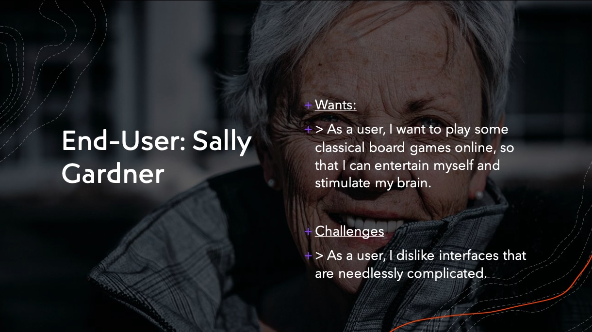

<div align="center">


</div>

___

# UX Design

In this section, we discuss the User Experience (UX) design of our app. We start by outlining the design process and ideation and evolution of user interface (UI) design. We then identify our stakeholders and provide details regarding their 'stories'. Following this, we discuss our UX approach and design and discuss the importance of the user group.

## Table of contents

* [**UX Design: introduction**](#ux-design--introduction)
  * [Design Process and Ideation](#design-process-and-ideation)
  * [Evolution of UI Design](#evolution-of-ui-design)
* [**Identification of users and stakeholders**](#identification-of-users-and-stakeholders)
* [**UX approach : design methods**](#ux-approach--design-methods)
  * [Design heuristics](#design-heuristics)
  * [User-centred design](#user-centred-design)
* [**Understanding user group**](#understanding-user-group)
  * [Stakeholders](#stakeholders)
  * [End-users](#end-user)
  * [Stakeholder stories](#stakeholder-stories)
  * [Product manager](#product-manager)
  * [Sponsor](#sponsor)
* [**Wireframes and interaction flow diagrams**](#wireframes-and-interaction-flow-diagrams)
  * [The end-users](#the-end-users)
  * [The product manager](#the-product-manager)
  * [The sponsor](#the-sponsor)


## UX Design : introduction

With regard to the UX design, we felt it was very important early on to consider how the design of our product would impact our stakeholders. We began this process in the project ideation phase. For a discussion on our design process and ideation, see [Design process and ideation](#design-process-and-ideation).

We also realised that this design process would change and develop over time. To capture this evolution of our design, we provide a detailed overview of the evolution of our UI design. For a discussion of this, see [Evolution of UI Design](#evolution-of-ui-design). As previously mentioned, from an early stage we were very aware of how important our stakeholders were in shaping the UI design. For details about our users and stakeholders, see [Identification of users and stakeholders](#identification-of-users-and-stakeholders). Finally, we talk about our approach to UX, and in particular, focus on the design methods we made use of to ensure that our product met their personal requirements. For a discussion of this, see [UX approach - design methods](#ux-approach--design-methods).

### Design Process and ideation


First, let's discuss our design process and ideation. This phase of the development lifecycle was not only fun and exciting but it gave rise to a collaborative ideation which served to kickstart our product design. This process occurred over a relatively short timeframe, and involved changes, alterations and refinements along the way.

Below is a mind map created for our project ideation phase. This mind map shows the different types of games we were considering when trying to determine what board game to build. The types of games were decided by our team during a group meeting on Microsoft Teams. Each team member contributed their own ideas, and we compiled a list of games that we knew of and were interested in.

<div align="center">


</div>

As you can see, the list of games we came up with encompassed a wide range of possible games, each of which has a large possibility of specific games within each type of game. We felt that this range encompassed enough variation for us to be creative and come up with interesting suggestions during the ideation phase.

Below is another mind map which contains different world issues and problems. As with the above mind map, as a team we came up with a list of real world problems during one of our first meetings concerning the game ideation. The idea here was to use a particular type of game to tackle one of these real world problems. So, for instance, green/environmental issues could be addressed through an educational card game or a board game.

<div align="center">


</div>

The images below show the ideas matrix we used to generate ideas for the application. As you can see, different types of games are in the rows and different types of real-world issues are in the columns. This creates a matrix where the remaining cells within the matrix are left to be populated with a particular game designed to solve a particular world problem.

[](https://postimg.cc/WDSwH6J1)

As you can see, the rows are populated with different types of games. These include 'unforgiving games' 'card games' 'guessing games' and 'educational games'. And along the columns you can see that there are different real-world issues such as 'political issues' 'mental health issues' and 'learning english'.

[](https://postimg.cc/MMFbW65k)

After some deliberation, our team decided that we would develop a product to address loneliness and isolation in older adults. This, we felt, was a very important issue in society, and was something that each one of us had direct experience of with older grandparents. It was also an issue that could be addressed through 'serious play'.  This concept was, as mentioned in the [Background](../Portfolio/Background.md) section of this report, essential for shaping our understanding of the product - namely, what it would look like and how it would work. So, using this concept, and in particular, Zimmerman's category of 'game play', we were able to make informed decisions regarding this stage of the product design. In particular, we decided on the basic structure and rules of the platform and how it would serve to help our end-users. As discussed in the subsection on the [psychology of playing games](../Portfolio/Background.md#the-psychology-behind-playing-games), there were several questions we had to ask during this ideation phase. For instance: does our app have a clear goal? Is this goal apparent upfront to the user, or is it something they have to discover through using our platform? Will our application raise awareness of an issue? And if it does, will this be explicit or implicit in the product? These were all pertinent questions we had to ask ourselves when considering the design our application. By using these questions, we were able to pin down key goals of our platform.

As already mentioned, we decided that our product would aim to promote behaviour change through an online gaming platform. We agreed that this would serve to address the issues of loneliness and isolation in our end-users. And we wanted to design the product to facilitate brain training, develop fine motor skills and strategic thinking capabilities through challenging games. Having researched the [extrinsic and intrinsic motivations](../Portfolio/Background.md#extrinsic-vs-intrinsic-motivations) that drive gameplay, we knew that our end-users would have extrinsic motivations in the form of leaderboards, winning games, and social contact and that these motivations would, over time, turn into intrinsic motivation in the form of enjoyment, purpose, growth, and curiosity. It was, therefore, important for us to bear both of these motivations in mind when designing the UI. That is, to find an alignment between these intrinsic and extrinsic motivations, and integrate features capable of eliciting both of them. This was of great importance.

Overall, this design and ideation phase was an excellent way to bounce around ideas and hone in on a narrow range of games. But this ideation phase required refinement. In particular, we needed to improve and enhance the UI and UX. So, we moved on to produce a paper prototype, prototype video, UI wireframe, and an updated UI wireframe. With these steps in the UI and UX design, we developed further insights about what our end-users wanted. With this in mind, we now go on to explain the evolution of the app's UI design. This evolution changed and developed over time with a total of four separate versions.

### Evolution of UI Design

**Version 1: paper prototype**

At this stage, we used the shared powerpoint in Teams to brainstorm and design each web page separately with consideration of the content and functionality of each page.

**Version 2: short paper prototype video**

At this stage, we integrated all the web pages together and focused on adding navigation between the pages. We filmed a short video demo to make sure the navigation flow goes well.
<br/><br/>
<p align="center">
  
  <br/>
  <b >Paper Prototype Demo</b>
  <br/><br/>
</p>

**Version 3: UI wireframe in Figma**

At this stage, we converted the paper prototype of our website to a wireframe to simulate all the features (including the structure of menu, button control, requests and responses) we have planned with the use of [Figma](https://www.figma.com/) (a digital design and prototyping tool). See our initial wireframe version [here](https://www.figma.com/proto/0CgBZ0XKPHl8fCcgvPSsWr/NotSoBoredGames-Copy?node-id=6%3A137&scaling=scale-down&page-id=6%3A121).


**Version 4: Updated UI wireframe in Figma**

We distributed the digital UI prototype to the potential users and created a test to gather user feedback with a focus on the feasibility of the website, the functionality and ease of use. We distributed our digital UI prototype to the potential users with an online questionnaire to gather feedback and update our wireframes.

Here are some sample questions from the prototype test:


See our full test report [here](https://my.helio.app/report/01F1WDKPM82XVYYJVE0HS5Q93T).
<br/><br/>

Based on the report, we focused on the following key issues to update:

- We updated the profile page of the user and added more information about the user's gaming experience to enhance the user experience. This includes the number of matches recently played, the win rate of the user, the people recently played with etc.

- We added a "how to play" button under the title of each games and the player can click on the button to learn the rules and operations before starting the game.

- After the game menu page, we planned to add a new option for the user to choose who they want to play with. If the user chooses to play with friends, we will provide the online friends from their friend list so that they can select and send invitation to the friend.

- We added a button to view the leaderboard of each game.

- We used combination of text and icon to present information/button.

Here is the [updated wireframe](https://www.figma.com/proto/fEaURWLCXr8yoBFjMjvQzi/NotSoBoredGames?node-id=6%3A137&scaling=scale-down&page-id=6%3A121) for our website:
<br/><br/>
<p align="center">
  
  <br/>
  <b align="center">UI Wireframe</b>
  <br/><br/>
</p>

The UI wireframe above provides a low-fidelity skeleton of the UI. This serves to show the main features, layout, content, and functionality of the UI, without getting bogged down in the visual design of the app. It is essential in UI design as it determines what the user will eventually interact with when they eventually use the software, and it helps those working on the front-end of the product to better understand how they should design and build the main features and functions of the UI.

With the insights gained from the subsection on [digital literacy](../Portfolio/Background.md#digital-literacy) in the Background section, we were very mindful when creating the UI wireframe of how important it was to make our application as simple and straightforward as possible. Given this, the start page, login and both games are all designed to have a limited number of features, the style of which is clear, brightly coloured, and easy to navigate. This approach to UI was very important because the elderly demographic have the lowest levels of digital literacy. Making the application simple and easy to use was, therefore, an absolute necessity to ensure it was accessible to those end-users. To not do so would amount to excluding those end-users from using the product, which is at odds with our approach to UI and UX design. The game design, and in particular, the usability requirements for our target users are explored in more depth in the next subsection [Game design for older people](#game-design-for-older-people).

Turning back to the UI wireframe, it can be presented in the form of a UI demo, as shown below:

<br/><br/>
<p align="center">
  
  <br/>
  <b align="center">UI Demo</b>
  <br/><br/>
</p>

This demo shows the way the user will navigate through our application, and how they will play the games with other players. As you can see, in each of these stages the UI design of our product evolved and developed. This development took us from a very crude paper prototype to a clear, intuitive, well thought out UI wireframe, the functionality of which is demonstrated in the above demo. It also gave us a visual template for the front end of our product. During this process, we had already decided on our users and stakeholders and the UX approach we would take with regards to our end-users. First, let's introduce our users and stakeholders.

## Identification of users and stakeholders

When identifying the users and stakeholders, we took the decision to use two end-users and two additional stakeholders to advise us during the development lifecycle. For the sake of clarity, our users are the individuals, groups, and organisations who will *use* our product and the stakeholders include any individuals, groups, and organisations that may be *affected* by our platform.

```
  1. End-user: member of target group
  2. End-user: member of target group
  3. Product manager: specialist external advisor
  4. Sponsor: external sponsor with understanding of end-users

```

The end-users are two members of our target group, both with interests in online gaming as a platform for connecting with others. The two additional stakeholders are a product manager who offers advice on the design of the product, and a care home manager acting as a sponsor. It is important to note that these end-users and stakeholders are all 'proto-personas'. These [proto-personas](https://pdmethods.com/proto-personas/) are based on assumptions about relevant stakeholders, and are designed to simulate the approach taken in a real-life agile project, during which there is a continuous dialogue between the software development team and their clients, owing to the client-led approach at the heart of the agile framework. These fictional characters whose identities have been created to guarantee our approach aligns with the agile method hold views that represent feedback collected from real users obtained through the methods used to evaluated our design, as well as our own personal reflections on the product design from the perspective of our end-users. For a discussion of the strengths and weaknesses of this method, see our [Evaluation](../Portfolio/Evaluation.md#user-stories).

There was plenty of scope to include more stakeholders to this list of four. For instance, we could have included administrative staff who might work for NotSoBored games, who communicate with stakeholders about any new features or updates. We could also have included charities and organisations who care for and/or support older adults. Other potential stakeholders could include family members of our end-users, whose more advanced understanding of digital technology could be used to support their older family members. However, due to time-constraints we decided that four stakeholders would suffice to inform us during the each sprint. This approach adopts an [autoethnography](https://www.researchgate.net/publication/260778406_Autoethnography_as_a_research_method_Advantages_limitations_and_criticisms) approach. An autoethnography is a form of qualitative research based on self-reflection and the process of writing to explore and understand personal experiences and connect this autobiographical story to wider societal issues. For our purposes, this relates to self-reflection on the position of our stakeholders via proto-personas. This was an excellent method for adding stakeholders into our agile development, and meant that despite being able to meet older adults in person show them our product, we were able to reflect on what their responses might be. This, together with the questionnaire data we gathered meant we could adjust our UI and UX design to best serve our end-users.

Now, before turning to our stakeholder stories, we consider the UX approach and design methods we took to shape the style and design of our product to meet the usability requirements of end-users.

## UX approach : design methods

When considering the UX approach, we felt it was important to choose something tried and tested, which we could rely on to guide us. For this reason we chose to use the 'ten commandments' articulated by Jakob Nielson and Rold Molich in their famous paper "Improving a Human-Computer Dialogue"[**6**](#references). In this paper, the authors claim that there are a set of principles (referred to as heuristics) which people in industry can use and adopt to make an informed assessment of their human-computer interaction. Let's explore this in more depth.

### Design heuristics

Before explaining our design heuristic method, we should define what a heuristic is. A heuristic is a quick, effective way to solve a problem or decide on a particular course of action. It's a practical shortcut which is known to work. In the context of UX design, professionals can assess a design or products' usability by means of heuristics. These heuristics are contained within a criteria or list of questions to ask so as to identify limitations and faults with the design. This helps to catch any issues which may have been overlooked by the team responsible for UX and UI design. Here are a list of 10 design heuristics we used to inform our design decision making process:

```
   1. Keep users informed about its status appropriately and promptly.
   2. Show information in ways users understand from how the real world operates, and in the users’ language.
   3. Offer users control and let them undo errors easily.
   4. Be consistent so users aren’t confused over what different words, icons, etc. mean.
   5. Prevent errors – a system should either avoid conditions where errors arise or warn users before they take risky actions (e.g., “Are you sure you want to do this?” messages).
   6. Have visible information, instructions, etc. to let users recognise options, actions, etc. instead of forcing them to rely on memory.
   7. Be flexible so experienced users find faster ways to attain goals.
   8. Have no clutter, containing only relevant information for current tasks.
   9. Provide plain-language help regarding errors and solutions.
   10. List concise steps in lean, searchable documentation for overcoming problems.
```

We used these criteria to conduct a heuristic evaluation of our product's design. Whilst they might appear slightly obvious, they were nonetheless an extremely helpful point of reference when making design decisions. What's more, they nicely dovetailed with our user-centred design (UCD), to which we now turn.

### User-centred design

The goal of the design process is to make the product as usable as possible. This is why we adopted a UCD. Coined by Rob Kling in 1977, this approach has the following steps:

  1. Simplifying the structure of the tasks such that the possible actions at any moment are intuitive.
  2. Make things visible, including the conceptual model of the system, actions, results of actions and feedback.
  3. Getting the mappings right between intended results and required actions.
  4. Embracing and exploiting the constraints of systems

The principles behind these steps are:

  1. Design is based upon an explicit understanding of users, tasks and environments.
  2. Users are involved throughout design and development.
  3. Design is driven and refined by user-centred evaluation.
  4. Process is iterative.
  5. Design addresses the whole user experience.
  6. Design team includes multidisciplinary skills and perspectives.

Using this UCD was really beneficial since it helped focus our attention on the users and their needs, wants and requirements. As a result, we had a better idea of design requirements for older people. We will now take a closer look at these design requirements.

### Game design for older people

For a better insight into the usability requirements for our target users, we now look at design requirements. As mentioned in the subsection on [digital literacy](../Portfolio/Background.md#digital-literacy) in the Background section, a digital game for the elderly should be designed with the needs of the target user in mind. In particular, it is important to design the game according to the technical competence of the user and familiarity with digital interfaces and online platforms. In addition to this, there are also mental and physical impairments associated with old age such as loss of hearing, vision, motor movement, and reduced cognitive abilities both in terms of memory and executive function. As a result, older adults tend to have slower response times to game stimuli.

In light of these user requirements, we decided to tailor our approach. For this, it was useful to turn to research on the design of digital games. Take, for instance, research conducted by Ijsselsteijn et al () in which the design of digital games for the elderly is considered from the perspective of health and psychology. In this work, the authors stress the importance of going beyond typical usability requirements to account for the wide range of abilities and impairments in the 70 and above age group. Some of the suggestions include:

 - Using a game for social and educational purposes
 - For relaxation and entertainment
 - Motivation for sharpening the mind
 - Encouraging physical activity

The first three of these suggestions are applicable to our application. It is these types of game design that we wanted our product to be based upon. From our perspective, we agreed that it was important to address the issues of loneliness and isolation in a fun, playful way. We wanted our platform to be viewed as a form of entertainment that could be used for social and cognitive purposes. We also decided to create our platform as a game with rules and structure because we felt that a game of this type would encourage competition and entertainment and lend itself to sharpening the mind in a social interaction - all delivered through a simple, visually appealing front-end.

Using these insights we were able to optimise the the product design.

## Understanding user group

As we showed in the above section on [Evolution of UI Design](#evolution-of-ui-design), one of the methods we used to better understand our user group was questionnaires. In particular, we distributed a digital UI prototype to potential users with an online questionnaire. This was a very effective way of obtaining clear, unambiguous information from our users regarding the UI of our product. Another method we used to improve our understanding of our users was through user stories. In what follows, we identify our users and stakeholders before detailing the user and stakeholder stories we used to develop our understanding the group who would eventually be using our product.


## Stakeholders

In what follows, we will outline our stakeholder stories. These stories will list important and relevant information about our stakeholders, particularly with regard to their knowledge and experience of the product we will be developing. These stakeholders will then form a major part of our sprints, the details of which can be found in [Documentation of sprints](../Portfolio/Sprints_Project_Management.md#documentation-of-sprints).


## User stories
___

## End-user

Turning to our stakeholders, we have the first of our end-users. This end-user is Bob Smith. Below we have broken down his 'wants' and 'challenges', as well as his motivations, experience, expectations, and special requirements in relation to our product.

___

<div align="center">


</div>

### Motivations

Bob enjoys playing board games, but he has no experience with digital games. His motivations are as follows:

  *"I want a challenge, but I want to challenge myself with friends and family. I want to play games to stimulate my brain and learn more. I also don't want to get lost in the complexity of a 'busy' interface."*

Bob thinks that online games aren't just for teenagers but are for people of all ages, and that if the process of playing online games was made more accessible and easy-to-understand then there would be a greater uptake in online games among older adults.

### Expectations

Bob's expectations are as follows:

  *"I expect the application will be easy to use. I want the interface to bright, bold and easy to see. I also want to be challenged by the games and compete against other players. A leaderboard would be a great feature as well."*

### Special Requirements

Bob'd special requirements are:

   * Bob's vision has been fading for a few years so he would really like to have a bright, lively interface to engage with.
   * Bob's memory occasionally fails him, so he would like there to be short instructions on how to play the games.

Tailoring the product design to meet these needs would, therefore, be beneficial to Bob's experience and ensure that he is able to use the product. Making sure that the UI and UX takes into account his expectations and special requirements is of great importance.

## End-user

The second of our end-users is Sally Gardner. Her personal requirements are included below.

___

<div align="center">



</div>

### Motivations

Sally knows nothing about digital games. She used to play board games when she was younger, but she doesn't play anyone since she doesn't socialise very much. After her husband passed away a few years ago, she began to withdraw from social life. Her family visit her when they can, but they would like to see her more often. Her motivations are:

  *"I want to socialise with family and loved ones, and I want to engage in something that is fun. I want to see my game history, and have an account where I can look at my friend's game history."*

Sally thinks that an online game platform might a good way for her to connect with his family more regularly and overcome the loneliness and isolation she's been feeling since her husband's death.

### Expectations

Sally's expectations are as follows:

  *"I don't want the games to be too difficult for her, and I want to be able to see my opponent while I play the games. It's also really important that the layout of the website will be easy to navigate."*

### Special Requirements

Sally's special requirements are:

   * Sally experiences anxiety, so she doesn't want to feel overwhelmed by the interface.
   * Sally's hearing isn't particularly good so if there is audio she wants it to be loud.

As with Bob, tailoring the design of the product to meet Sally's needs will be beneficial to sally's experience and increase the likelihood that she will use the product.

## Stakeholder stories
___

## Product manager

The third stakeholder is a product manager called Jack Barnett. As with the end-users, his background and interest in the project is listed below.

___

<div align="center">


</div>

### Motivations

Jack, 36, is a product manager. In his role as a product manager, he is responsible for setting the strategy and vision of a product. He also advises on the development methodology, evaluating ideas and feedback from end-users and other stakeholders, and making sure those views are integrated into the development process. His aim is to do this as seamlessly as possible. His motivations are as follows:

  *"I want this team to deliver a good product to the end-users. I want us to create added value and improve the quality of life of the end-users - I'm a firm believer that the Agile methodology will assist us in this process."*

He also advises teams on prioritising features and setting weekly goals and targets. For our purposes, he will be advising us throughout the development process.

### Expectations

Jack's expectations are as follows:

  *"I expect the group will use the Agile methodology as best they can, that they will communicate regularly. I want the team to aim to produce a minimum viable product (MVP) as soon as they can. I expect the group to make sure that the needs of the end-user are put above all else."*

Meeting these expectations is important for our project since the advise of the product manager is invaluable. He is experienced and well-informed on the processes underlying the development lifecycle and best practices.


## Sponsor

Our final stakeholder is called Simon Sharma. His background and requirements are listed below.

___

<div align="center">


</div>

### Motivations

Simon, 69, is the manager of a local care home. He has first-hand experience of the needs of our target audience, namely older adults, and he knows the potential of using games to enhance their wellbeing. He has been a regular gamer for many years, and he firmly believes it is one of best form of entertainment. His main motivations are as follows:

  *"I want the product to help improve the lives of residents in the care home I manage. I would like to use the platform myself to further cultivate close relationships with the care home residents, and find out whether they are using the product."*

His feedback during the sprint cycles is invaluable, since he not only understands the wants and desires of older adults, but also, as an older adult with an interest in online games, he is well placed to advise on the type of user interface that would be most effective.

### Expectations

Simon's expectations are as follows:

  *"I expect the group to embrace the project using the Agile methodology, and that the group listen to the stakeholders throughout the build. I also expect the games to be presented in a clear way and are challenging enough to push the residents. It would also be very useful to have multiplayer and video chat functionality."*

As with the above-mentioned stakeholders, tailoring the design of the product to meet these expectations will be beneficial to our stakeholders' interaction with and experience of the NotSoBored Games application.


## Wireframes and interaction flow diagrams

Using the stakeholder stories we now can create a use case diagram in which the main user stories are depicted in a graphical representation of their interactions with our system. As you can see, there are also two product manager stories both of which are linked to the user stories. These stories include creating an account, playing multiplayer games, viewing your profile, game history, leaderboard, and friend list. This set of stories helped signpost us towards our end prototype, and offered a logical oder of tasks and features to prioritise.


<div align="center">


</div>

There are many ways in which our stakeholders will interact with the different parts of our system. These are outlined below:

### The end-users
```
  The end-users login and play games against friends and family members. The profile page contains information on
  a user's friends as well as their game history.

  The end-user can use the the platform to compete for the top spot on the leaderboard.

  The end-user can communicate with friends and family through live video chat.
```

### The product manager
```
  The product manager can access information regarding the end-users, the sponsor, and game results to determine
  how stakeholders are using the product.

  The product manager can check for user engagement and assess user satisfaction.

  The product manager can track web traffic to the website over time, and consider the viability of monetisation
  of the product.
```
### The sponsor
```
  The sponsor uses the website to create profiles for end-users.

  The sponsor shows end-users how to use the product.

  The product manager can check for user engagement and assess user satisfaction.

  The sponsor is able to use the platform as a way to improve the quality of life of their care home residents.
```

These main interactions with the various parts of our system can be shown in another graphical depiction, namely the interaction flow diagram below:


<div align="center">


</div>

In the above interaction flow diagram you can see our three main stakeholders. The product manager represents our product and on either side of him you have the end-user and the sponsor. Their main interactions with the product are included, such as creating an account, playing games, viewing game history and tracking user engagement. In addition to this, we have a flowchart which shows the steps our end-users will go through when using our product:


Taken together, these interaction flow diagrams and the front-end flowchart capture the main steps the user will go through when using our product.

## References

[3] Ijsselsteijn W., Herman H. et al., “Digital game design for elderly users”, Eindhoven University of Technology, 2007. https://dl.acm.org/citation.cfm?id=1328206

[4] Wang J., “Digital Game Design for Elderly Users: A Multi-Disciplinary Review”, The University of Birmingham, School of Computer Science, August 2016, http://www.cs.bham.ac.uk/~rjh/courses/ResearchTopicsInHCI/2015-16/Submissions/wangjiahui.pdf

[5] Inspiration for our proto-personas came from the following source https://www.uxpin.com/studio/blog/ux-designers-5-minute-guide-lean-personas/

[6] Rolf Molich and Jakob Nielsen. 1990. Improving a human-computer dialogue. Commun. ACM 33, 3 (March 1990), 338–348. DOI:https://doi.org/10.1145/77481.77486

[7] Tsai, Hsin-Yi Sandy et al. “Social Support and "Playing Around": An Examination of How Older Adults Acquire Digital Literacy With Tablet Computers.” Journal of applied gerontology : the official journal of the Southern Gerontological Society vol. 36,1 (2017): 29-55. doi:10.1177/0733464815609440
___

## Navigate

- [Go To Next Section: Sprints & Project Management](../Portfolio/Sprints_Project_Management.md)
- [Go To Previous Section: System Implementation](../Portfolio/System_Implementation.md)
- [Go Back To Readme](../README.md)
